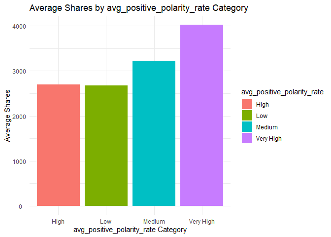

ST558: Project 2
================
Michael Bradshaw and Yejun Han
2023-07-07

- <a href="#channel-of-interest-business"
  id="toc-channel-of-interest-business">Channel of Interest: Business</a>
  - <a href="#introduction-to-the-project"
    id="toc-introduction-to-the-project">Introduction to the Project</a>
  - <a href="#import-the-data" id="toc-import-the-data">Import the Data</a>
  - <a href="#splitting-the-data-into-test-and-training-datasets"
    id="toc-splitting-the-data-into-test-and-training-datasets">Splitting
    the data into test and training datasets</a>
  - <a href="#summarizations-both-michael-and-yejun"
    id="toc-summarizations-both-michael-and-yejun">Summarizations (Both
    Michael and Yejun)</a>
  - <a href="#modeling-both-michael-and-yejun"
    id="toc-modeling-both-michael-and-yejun">Modeling (Both Michael and
    Yejun)</a>

# Channel of Interest: Business

## Introduction to the Project

The working data set is about the online news popularity, and nearly 60
kinds of variables are included, such as n_tokens_title,
n_unique_tokens, num_imgs, num_videos, average_token_length,
num_keywords, weekday_is\_, is_weekend, rate_positive_words,
max_negative_polarity, title_subjectivity, and shares. The work intends
to analyze the data and fitting model with the shares as target variable
under one of data_channels, and then apply to other data_channels. The
data was firstly imported and non-predictor variables such as url and
timedelta were removed. The data was then summarized, and the variables
of day_of_week, content_length, avg_positive_polarity, num_keywords, and
length of title were respectively analyzed through with statistics and
plots. In modeling, both linear regression model and ensemble tree-based
models were adopted. The four created models were comparatively
analyzed, and the optimum model was selected.

## Import the Data

In this section, we first import the raw online news popularity dataset.
We remove the non-predictor variables named url and timedelta. Next, we
create three new variables: the first is called *channel* based on the
values of the *data_channel_is\_* variables. The second new variable is
called *day_of_week* based on the values of the *weekday_is\_*
variables. The third new variable is called *content_length* based on
the values of the *n_tokens_content* variable. The *content_length
*variable is assigned values based on the conditionals provided,
categorizing the length of the content as “Very Short,” “Short,”
“Medium,” or “Long.”

Lastly, we subset the imported newsData into separate data frames for
each specific channel.

``` r
#Import the newsData csv file:
newsData <- read.csv(file="..//OnlineNewsPopularity//OnlineNewsPopularity.csv")

# Create single variable for data channel: 
newsData <- newsData %>% 
  dplyr::select(-url, -timedelta) %>%
  mutate(channel = ifelse(data_channel_is_lifestyle == 1, "Lifestyle",
                   ifelse(data_channel_is_entertainment == 1, "Entertainment",
                   ifelse(data_channel_is_bus == 1, "Business",
                   ifelse(data_channel_is_socmed == 1, "SocialMedia",
                   ifelse(data_channel_is_tech == 1, "Tech",
                   ifelse(data_channel_is_world == 1, "World", "Other")))))),
         day_of_week = ifelse(weekday_is_monday == 1, "Monday",
                       ifelse(weekday_is_tuesday == 1, "Tuesday",
                       ifelse(weekday_is_wednesday == 1, "Wednesday",
                       ifelse(weekday_is_thursday == 1, "Thursday",
                       ifelse(weekday_is_friday == 1, "Friday",
                       ifelse(weekday_is_saturday == 1, "Saturday", "Sunday")))))),
         content_length = ifelse(n_tokens_content <= 250, "Very Short",
                        ifelse(n_tokens_content <= 410, "Short",      
                        ifelse(n_tokens_content <= 750, "Medium", "Long"))),
         title_length = ifelse(n_tokens_title <= 8, "Short",
                               ifelse(n_tokens_title <= 12, "Medium",      
                               ifelse(n_tokens_title <= 15, "Long","Very Long"))),
         avg_positive_polarity_rate = ifelse(avg_positive_polarity <= 0.2, "Low",
                               ifelse(avg_positive_polarity <= 0.3, "Medium",      
                               ifelse(avg_positive_polarity <= 0.4, "High","Very High")))
         )

newsData$channel <- as.factor(newsData$channel) #Converting to factor
newsData$day_of_week <- factor(newsData$day_of_week,
                               levels = c("Sunday", "Monday", "Tuesday", 
                                          "Wednesday", "Thursday", 
                                          "Friday", "Saturday"))
newsData$content_length <- as.factor(newsData$content_length)
# Subset the data for each data channel
newsData_channel <- newsData %>% filter(channel == params$channel)
```

## Splitting the data into test and training datasets

This section creates training and test indices based on the *shares*
variable, and splits the data frames for each channel into separate
training and test sets for modeling.

``` r
# Set the seed for reproducibility
set.seed(717)

# Create the training and test indices
trainIndices <- createDataPartition(newsData_channel$shares, p = 0.7, list = FALSE)

# Split the data into training and test sets
train_Data <- newsData_channel[trainIndices, ]
test_Data <- newsData_channel[-trainIndices, ]
```

## Summarizations (Both Michael and Yejun)

In this first example, we look at a table summarizing the statistics of
the shares variable in our training dataset. We then create a histogram
to visualize the distribution of shares.

In a normal distribution,the histogram will have a symmetric shape with
a peak at the center and tails that extend symmetrically in both
directions. In a skewed distribution, the data can be either skewed to
the right or skewed to the left. In a right skewed distribution, the
histogram will have a long tail on the right side and a shorter tail on
the left side. The majority of observations will be concentrated on the
left side. In a left skewed distribution, the histogram will have a long
tail on the left side and a shorter tail on the right side, with the
majority of observations concentrated on the right side.

``` r
summary(train_Data$shares)
```

    ##     Min.  1st Qu.   Median     Mean  3rd Qu.     Max. 
    ##      1.0    952.2   1400.0   3146.7   2500.0 690400.0

``` r
# Histogram of shares
ggplot(train_Data , aes(x = shares)) +
  geom_histogram(binwidth = 2500, fill = "blue") +
  labs(x = "Shares", y = "Frequency") +
  ggtitle("Distribution of Shares") +
  theme_classic()
```

<!-- -->

In this second table, we display summary statistics for the shares
variable within our training dataset by day of the week. We display the
count (n), the total sum of shares (total_shares), the average shares
(average_shares), the standard deviation of shares (sd_shares), the
minimum shares (min_shares), and the maximum shares (max_shares) for
each group.

Next, we examine the is_weekend categorical variable by the shares
variable. We calculate the mean shares for each group (weekend
vs. non-weekend days).

Lastly, we create a bar plot to visualize the average shares by day of
the week. Higher bars indicate more shares on that day of the week.

``` r
#Shares by day of the week
average_shares <- train_Data %>%
  group_by(day_of_week) %>%
  summarise(n = n(),
            total_shares = sum(shares),
            average_shares = mean(shares),
            sd_shares = sd(shares),
            min_shares = min(shares),
            max_shares = max(shares))
average_shares
```

    ## # A tibble: 7 × 7
    ##   day_of_week     n total_shares average_shares sd_shares min_shares max_shares
    ##   <fct>       <int>        <int>          <dbl>     <dbl>      <int>      <int>
    ## 1 Sunday        237       860626          3631.     5562.        692      56900
    ## 2 Monday        813      3656536          4498.    33633.          1     690400
    ## 3 Tuesday       853      2541849          2980.    12086.         44     310800
    ## 4 Wednesday     884      2434089          2753.     8690.         63     158900
    ## 5 Thursday      842      2209977          2625.    11362.         81     306100
    ## 6 Friday        591      1289821          2182.     2322.         22      21500
    ## 7 Saturday      162       795968          4913.    12265.        516     144400

``` r
weekend_mean_shares <- train_Data %>%
  group_by(is_weekend) %>%
  rename(Weekend = is_weekend) %>%
  mutate(Weekend = ifelse(Weekend == 0, "No", "Yes")) %>%
  summarize(mean_shares = mean(shares))
  
weekend_mean_shares
```

    ## # A tibble: 2 × 2
    ##   Weekend mean_shares
    ##   <chr>         <dbl>
    ## 1 No            3046.
    ## 2 Yes           4152.

``` r
ggplot(average_shares, aes(x = day_of_week, y = average_shares, 
                           fill = day_of_week)) +
  geom_col() +
  labs(x = "Day of the Week", y = "Average Shares", fill = "Day of the Week") +
  ggtitle("Average Shares by Day of the Week") +
  theme_classic() +
  theme(axis.text.x = element_text(angle = 45, hjust = 1))
```

<!-- -->

These tables display the average number of shares for different content
length categories. Summary statistics such as the count of observations,
the average number of shares, the standard deviation of shares, the
minimum number of shares (min_shares), and the maximum number of shares
(max_shares), and the range of shares (range_shares) are computed for
each content length category.

Next, a horizontal bar chart is created to help us visualize these
results by showing the average number of shares on the x-axis and the
content length categories (content_length) on the y-axis.

``` r
# Calculate the average shares by content length category
average_shares_byContent <- train_Data %>%
  group_by(content_length) %>%
  summarise(n = n(),
            average_shares = mean(shares),
            sd_shares = sd(shares),
            min_shares = min(shares),
            max_shares = max(shares),
            range_shares = max_shares - min_shares)
average_shares_byContent
```

    ## # A tibble: 4 × 7
    ##   content_length     n average_shares sd_shares min_shares max_shares range_shares
    ##   <fct>          <int>          <dbl>     <dbl>      <int>      <int>        <int>
    ## 1 Long            1036          4453.    24352.          1     690400       690399
    ## 2 Medium          1099          2342.     5611.         63     144400       144337
    ## 3 Short           1082          2108.     4263.         44      78600        78556
    ## 4 Very Short      1165          3709.    22397.         22     652900       652878

``` r
# Create the horizontal bar chart
ggplot(average_shares_byContent, aes(x = average_shares, y = content_length, fill = content_length)) +
  geom_bar(stat = "identity") +
  labs(x = "Average Shares", y = "Content Length Category", fill = "Content Length") +
  ggtitle("Average Shares by Content Length Category") +
  theme_minimal() +
  theme(axis.text.y = element_text(hjust = 0.5))
```

<!-- -->

To analyze the connection between avg_positive_polarity and
average_shares. The numeric data was conveted to categorical data
avg_positive_polarity_rate (“Low”, “Medium”,“High”,“Very High” ). It’s
interesting that the low avg_positive_polarity_rate displyed the highest
average_shares. The high and medium avg_positive_polarity are similar in
average_shares.

``` r
# Calculate the average shares by avg_positive_polarity_rate category
average_shares_byavg_positive_polarity_rate <- train_Data %>%
  group_by(avg_positive_polarity_rate) %>%
  summarise(n = n(),
            average_shares = mean(shares),
            sd_shares = sd(shares),
            min_shares = min(shares),
            max_shares = max(shares),
            range_shares = max_shares - min_shares)
average_shares_byavg_positive_polarity_rate
```

    ## # A tibble: 4 × 7
    ##   avg_positive_polarity_rate     n average_shares sd_shares min_shares max_shares
    ##   <chr>                      <int>          <dbl>     <dbl>      <int>      <int>
    ## 1 High                        2246          2702.     8467.         63     306100
    ## 2 Low                          142          2673.     6489.        441      57200
    ## 3 Medium                       852          3227.    22773.         22     652900
    ## 4 Very High                   1142          4021.    23800.          1     690400
    ## # ℹ 1 more variable: range_shares <int>

``` r
# Create the horizontal bar chart
ggplot(average_shares_byavg_positive_polarity_rate, aes(x = avg_positive_polarity_rate, y = average_shares, fill = avg_positive_polarity_rate)) +
  geom_bar(stat = "identity") +
  labs(x = "avg_positive_polarity_rate Category", y = "Average Shares", fill = "avg_positive_polarity_rate") +
  ggtitle("Average Shares by avg_positive_polarity_rate Category") +
  theme_minimal() +
  theme(axis.text.y = element_text(hjust = 0.6))
```

<!-- -->

Here is the summary plot of average_share versus num_keywords. When the
number of keywords is less than 8, the average_shares increase with the
increase of keywords, except when there are 5 keywords.When there are
more than 8 keywords, the average_share will gradually decrease.It
suggests that a moderate number of keywords will increase
average_shares.

``` r
# Calculate the average shares by number of keywords
average_shares_bynum_keywords <- train_Data %>%
  group_by(num_keywords) %>%
  summarise(n = n(),
            average_shares = mean(shares),
            sd_shares = sd(shares),
            min_shares = min(shares),
            max_shares = max(shares),
            range_shares = max_shares - min_shares)
average_shares_bynum_keywords
```

    ## # A tibble: 9 × 7
    ##   num_keywords     n average_shares sd_shares min_shares max_shares range_shares
    ##          <dbl> <int>          <dbl>     <dbl>      <int>      <int>        <int>
    ## 1            2    13          1717      1367.        655       5800         5145
    ## 2            3   172          2082.     4101.         81      48700        48619
    ## 3            4   510          2204.     3676.         28      47800        47772
    ## 4            5   868          2834.    12183.         22     306100       306078
    ## 5            6   858          3423.    23942.         83     690400       690317
    ## 6            7   654          4112.    26864.         63     652900       652837
    ## 7            8   476          3234.     9378.        119     158900       158781
    ## 8            9   329          3599.    17552.        393     310800       310407
    ## 9           10   502          2940.     4596.          1      56900        56899

``` r
# Create the horizontal bar chart
ggplot(average_shares_bynum_keywords, aes(x = num_keywords, y = average_shares, fill = num_keywords)) +
  geom_bar(stat = "identity") +
  labs(x = "num_keywords", y = "Average Shares", fill = "num_keywords") +
  ggtitle("Average Shares by number of keywords") +
  theme_minimal() +
  theme(axis.text.y = element_text(hjust = 0.5))
```

<!-- -->

Besides the length of content, the effect of length of title on
average_shares was also analyzed. In the plot of average_shares versus
length of title. The title with medium length showed the highest
average_shares, while which is just slightly higher than that of Long
and short length of title. It is obvious that very long titles will
reduce average_shares.

``` r
# Calculate the average shares by title length category
average_shares_byTitle <- train_Data %>%
  group_by(title_length) %>%
  summarise(n = n(),
            average_shares = mean(shares),
            sd_shares = sd(shares),
            min_shares = min(shares),
            max_shares = max(shares),
            range_shares = max_shares - min_shares)
average_shares_byTitle
```

    ## # A tibble: 4 × 7
    ##   title_length     n average_shares sd_shares min_shares max_shares range_shares
    ##   <chr>        <int>          <dbl>     <dbl>      <int>      <int>        <int>
    ## 1 Long           632          3137.     7511.        386      78600        78214
    ## 2 Medium        2791          3264.    20457.          1     690400       690399
    ## 3 Short          929          2705.     7228.         22     158900       158878
    ## 4 Very Long       30          6080.    11409.        569      49000        48431

``` r
# Create the horizontal bar chart
ggplot(average_shares_byTitle, aes(x = title_length, y = average_shares, fill = title_length)) +
  geom_bar(stat = "identity") +
  labs(x = "Title Length Category", y = "Average Shares", fill = "Title Length") +
  ggtitle("Average Shares by title Length Category") +
  theme_minimal() +
  theme(axis.text.y = element_text(hjust = 0.5))
```

<!-- -->

## Modeling (Both Michael and Yejun)

Each group member should contribute a linear regression model and an
ensemble tree-based model.

### Linear Regression Models

Linear regression is a modeling technique that attempts to form a linear
relationship between a response (dependent variable (i.e. shares)) and
one or more predictor (independent variables). In simple linear
regression, there is one predictor or independent variable as opposed to
multiple linear regression where there are multiple predictors. Linear
regression seeks to explain the values of our response variable based on
our predictor variables by fitting a straight line to the data that
minimizes the sum of the squared differences between the observed and
predicted values.

Our online news dataset contains a large number of predictors and we
don’t have a great sense of their relationship to the shares variable.
These relationships may change between data channels as well. If we look
at correlations between shares and the rest of the possible numeric
variables, we see a mix of small positive relationship, small negative
relationships, and some with little to no relationship.

``` r
# Calculate correlations between shares and all numeric variables
correlations <- cor(train_Data[, sapply(train_Data, is.numeric)], 
                    train_Data$shares)
correlations
```

    ##                                        [,1]
    ## n_tokens_title                 0.0060752010
    ## n_tokens_content               0.0306023930
    ## n_unique_tokens                0.0038733749
    ## n_non_stop_words               0.0018274017
    ## n_non_stop_unique_tokens       0.0143448763
    ## num_hrefs                      0.0342477099
    ## num_self_hrefs                 0.0197741532
    ## num_imgs                       0.0152757471
    ## num_videos                     0.0500110597
    ## average_token_length          -0.0286475194
    ## num_keywords                   0.0177288368
    ## data_channel_is_lifestyle                NA
    ## data_channel_is_entertainment            NA
    ## data_channel_is_bus                      NA
    ## data_channel_is_socmed                   NA
    ## data_channel_is_tech                     NA
    ## data_channel_is_world                    NA
    ## kw_min_min                    -0.0012390328
    ## kw_max_min                     0.0399404574
    ## kw_avg_min                     0.0436035967
    ## kw_min_max                    -0.0009498878
    ## kw_max_max                     0.0069598024
    ## kw_avg_max                     0.0255781124
    ## kw_min_avg                     0.0485062938
    ## kw_max_avg                     0.0482062937
    ## kw_avg_avg                     0.0824052407
    ## self_reference_min_shares      0.1555022658
    ## self_reference_max_shares      0.0873117485
    ## self_reference_avg_sharess     0.1334625344
    ## weekday_is_monday              0.0380843296
    ## weekday_is_tuesday            -0.0048443561
    ## weekday_is_wednesday          -0.0116761810
    ## weekday_is_thursday           -0.0150386292
    ## weekday_is_friday             -0.0224891299
    ## weekday_is_saturday            0.0204463823
    ## weekday_is_sunday              0.0068450697
    ## is_weekend                     0.0187920436
    ## LDA_00                        -0.0048449995
    ## LDA_01                         0.0038999546
    ## LDA_02                        -0.0197943351
    ## LDA_03                         0.0633575753
    ## LDA_04                        -0.0187340864
    ## global_subjectivity            0.0434918645
    ## global_sentiment_polarity     -0.0101081841
    ## global_rate_positive_words     0.0116549704
    ## global_rate_negative_words     0.0324344167
    ## rate_positive_words           -0.0133245041
    ## rate_negative_words            0.0153133547
    ## avg_positive_polarity          0.0174264118
    ## min_positive_polarity         -0.0146206568
    ## max_positive_polarity          0.0205422078
    ## avg_negative_polarity         -0.0598643490
    ## min_negative_polarity         -0.0599143923
    ## max_negative_polarity         -0.0272109076
    ## title_subjectivity             0.0079589057
    ## title_sentiment_polarity       0.0132212945
    ## abs_title_subjectivity         0.0242431769
    ## abs_title_sentiment_polarity   0.0106802531
    ## shares                         1.0000000000

In general, we see that the number of videos (num_videos), the number of
images (num_imgs) and the number of links (num_hrefs) have small
positive correlations. We also know from our descriptive analysis that
day of the week seems to influence the number of shares as well, but to
eliminate redundancy lets remove the weekday_is variables and the
is_weekend variables. Other variables that we might expect to influence
number of shares include the number of words in the title
(n_tokens_title), and the number of words in the content
(n_tokens_content). The LDA topic also appears correlated across
different data channels, so let’s include all of these variables since
they probably vary across different data channels. Lastly, in the
overall news dataset we notice that average keyword (kw_avg_avg) had a
positive correlation with shares, so let’s keep this in our model.

We can also remove all the data_channel variables as this information is
not needed within each data channel analysis.

``` r
# subset the data: 
train_Data_model <- dplyr::select(train_Data, shares, num_videos, n_tokens_content, n_tokens_title, num_imgs, num_hrefs, self_reference_min_shares, LDA_00, LDA_01, LDA_02, LDA_03, LDA_04, kw_avg_avg,day_of_week)

# all predictors from our subset:
lm_fit1 <- train(shares ~ . , data = train_Data_model, 
                            method = "lm", preProcess = c("center", "scale"),
                            trControl = trainControl(method = "cv", number = 5))
```

Here, we assess how well our first linear model fits the data based on
the ability to accurately predict the shares variable. The RMSE provides
an evaluation of the model’s performance.

``` r
# check the fit of our first linear model:
predslinear1 <- predict(lm_fit1, newdata = test_Data)
# See how well the model fits
postResample(predslinear1, obs = test_Data$shares)
```

    ##         RMSE     Rsquared          MAE 
    ## 9.845878e+03 3.758342e-03 2.644262e+03

Now, let’s suppose we were way off with all of our assumptions in terms
of the key variables to include. Let’s try a different appraoch and use
the leapSeq algorithm. This approach evaluates different subsets of
features to determine the subset that produces the best model
performance. And in this situation, we can do this with all of the
possible predictor variables, not just our subset of key variables. This
may require more computational power, so let’s do parallel processing.

``` r
# Parallel Processing
num_cores <- detectCores()-1
cl <- makeCluster(num_cores)
registerDoParallel(cl)

step_model_seq <- train(shares ~ . , data = train_Data, 
                 method = "leapSeq", preProcess = c("center", "scale"),
                 tuneGrid = data.frame(nvmax = 1:10), # up to 10 predictors max
                 trControl = trainControl(method = "cv", number = 5))
```

    ## Reordering variables and trying again:

``` r
step_model_seq$results
```

    ##    nvmax     RMSE    Rsquared      MAE   RMSESD  RsquaredSD    MAESD
    ## 1      1 15311.67 0.001414168 2895.662 8081.915 0.002131938 320.9400
    ## 2      2 15309.56 0.001782838 2891.854 8086.912 0.003383037 330.1716
    ## 3      3 15269.25 0.028327452 2901.065 8012.255 0.056968721 310.2409
    ## 4      4 15313.84 0.021743352 2918.331 7956.446 0.043738882 300.8942
    ## 5      5 15303.28 0.022130940 2896.543 7961.862 0.042956982 316.2851
    ## 6      6 15316.47 0.012164414 2919.766 7947.495 0.023994034 316.0168
    ## 7      7 15424.12 0.014153999 2915.062 7788.784 0.024220710 333.6950
    ## 8      8 15415.41 0.011859874 2908.933 7811.245 0.020772969 331.5241
    ## 9      9 15436.89 0.012683585 2923.581 7784.038 0.021194202 293.9652
    ## 10    10 15446.55 0.013499763 2953.457 7767.119 0.021565351 256.2610

``` r
step_model_seq$bestTune
```

    ##   nvmax
    ## 3     3

``` r
# Stop parallel processing
stopCluster(cl)
registerDoSEQ()
```

Here, we assess how well our second linear model fits the data based on
the ability to accurately predict the shares variable. The RMSE provides
an evaluation of the model’s performance.

``` r
predslinear2 <- predict(step_model_seq, newdata = test_Data)
# See how well the model fits
postResample(predslinear2, obs = test_Data$shares)
```

    ##         RMSE     Rsquared          MAE 
    ## 9.271713e+03 1.217593e-04 2.583984e+03

### Ensemble Tree-Based Models

### Random Forest Model:

Random Forest is an ensemble learning technique that uses decision tress
to make predictions. The idea is to construct an ensemble of decision
trees by training each tree on a random subset of the data and a random
subset of the predictors. Each individual tree independently make
predictions, but the final prediction is determined by aggregating the
results.

``` r
# Parallel Processing
num_cores <- detectCores()-1
cl <- makeCluster(num_cores)
registerDoParallel(cl)

rfFit <- train(shares ~ ., data = train_Data_model, method = "rf",
               trControl = trainControl(method = "cv", number = 5, repeats = 3),
               preProcess = c("center", "scale"),
               tuneGrid = data.frame(mtry = c(1:10)))

# Stop parallel processing
stopCluster(cl)
registerDoSEQ()

#review results:
rfFit$results
```

    ##    mtry     RMSE   Rsquared      MAE   RMSESD RsquaredSD    MAESD
    ## 1     1 13231.89 0.02607792 2813.262 11678.21 0.02358189 553.2820
    ## 2     2 13445.33 0.03136562 2881.079 11392.47 0.02769197 539.0044
    ## 3     3 13576.32 0.03205686 2922.865 11255.75 0.02879067 528.7880
    ## 4     4 13754.90 0.03411179 2983.772 11095.38 0.03316588 508.7481
    ## 5     5 13924.02 0.03193976 3004.029 11054.93 0.02988508 528.3656
    ## 6     6 14043.97 0.03716902 3024.726 10922.49 0.03976895 509.1362
    ## 7     7 14302.08 0.03834744 3062.109 10818.76 0.04677020 531.0386
    ## 8     8 14340.90 0.03576483 3044.708 10761.36 0.03981379 529.6378
    ## 9     9 14624.41 0.03554661 3083.529 10590.57 0.03940745 524.8704
    ## 10   10 14866.60 0.03608726 3120.442 10498.98 0.04220540 518.1679

``` r
rfFit$bestTune
```

    ##   mtry
    ## 1    1

Finally, we make predictions on test data using the trained Random
Forest model. The model fit diagnostics compares the predicted values
with the observed shares values from the test data. The RMSE provides an
evaluation of the model’s performance.

``` r
# Make predictions with random forest model
predsRf <- predict(rfFit, newdata = test_Data)
# Check model fit diagnostics
postResample(predsRf, obs = test_Data$shares)
```

    ##         RMSE     Rsquared          MAE 
    ## 9.273001e+03 9.880154e-03 2.481311e+03

### Boosted tree model:

Boosted tree model, also known as gradient boosting, combines multiple
weak prediction models to create a stronger and more accurate model.
Each tree is dependent on prior trees, i.e. fitting the residual of the
trees that preceded it, and improve the final accuracy.

``` r
# Boosted: Define the control parameters for cross-validation  
ctrl <- trainControl(method = "cv", number = 5)

# Define the tuning parameters:
boosted_grid <- expand.grid(n.trees = c(25, 50, 100, 150, 200),
                            interaction.depth = c(1, 2, 3, 4),
                            shrinkage = 0.1,
                            n.minobsinnode = 10)

# Specify the boosted tree model using the gbm package

# Set the number of CPU cores to use
num_cores <- detectCores()-1
# Set up parallel processing
cl <- makeCluster(num_cores)
registerDoParallel(cl)
boostFit <- train(shares ~ ., data = lifestyle_train_Data_model,
                       method = "gbm",
                       trControl = trainControl(method = "repeatedcv", 
                                                number = 5, repeats = 3),
                       tuneGrid = boosted_grid,
                       #suppress output
                       verbose = FALSE )
# Stop parallel processing
stopCluster(cl)
registerDoSEQ()
```

Then, the boosted tree model was evaluated, the performance across
test_Data was calculates.

``` r
# Make predictions with Boosted tree model
predsBf <- predict(boostFit, newdata = test_Data)

# Check model fit diagnostics
postResample(predsBf, obs = test_Data$shares)
```

    ##         RMSE     Rsquared          MAE 
    ## 9.367625e+03 4.878516e-03 3.007175e+03

### Comparison of Models

``` r
# Function to determine the best model
find_best <- function(lm1, lm2, rf, boost){
  # Put all the fit results in a data frame
  results <- data.frame(rbind("Linear Model 1"= postResample(lm1, test_Data$shares),
                                  "Linear Model 2"= postResample(lm2, test_Data$shares),
                                  "Random Forest"= postResample(rf, test_Data$shares),
                                  "Boosted Tree" = postResample(boost, test_Data$shares)))

  # Determine the name of the model with the lowest RMSE
  model_winner <- row.names(results)[results$RMSE == min(results$RMSE)]
  # Return both the data frame of results, as well as the row name of best model name in a list
  return(list(results, model_winner))
}

# search through to find the best model
best_model <- find_best(predslinear1, predslinear2, predsRf, predsBf)
# Print out the data frame of RMSE, Rsquared, and MAE
best_model[[1]]
```

    ##                    RMSE     Rsquared      MAE
    ## Linear Model 1 9845.878 0.0037583425 2644.262
    ## Linear Model 2 9271.713 0.0001217593 2583.984
    ## Random Forest  9273.001 0.0098801543 2481.311
    ## Boosted Tree   9367.625 0.0048785159 3007.175

``` r
# Print out a message that tells us which model is the best based on lowest RMSE
print(paste("The best model by finding the RMSE on the test data is the", best_model[[2]], "model.")) 
```

    ## [1] "The best model by finding the RMSE on the test data is the Linear Model 2 model."
