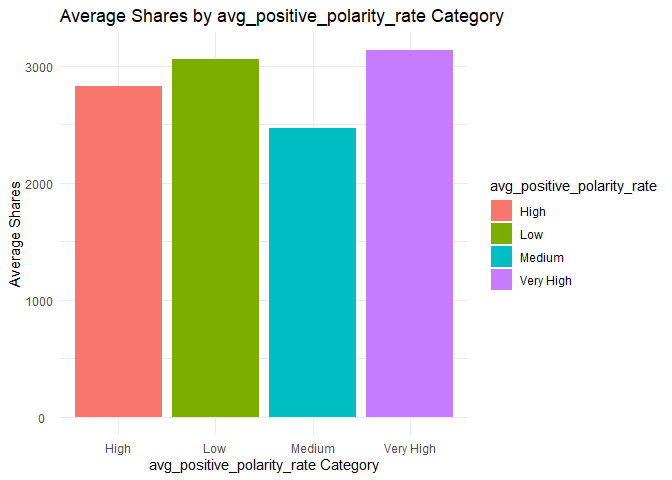
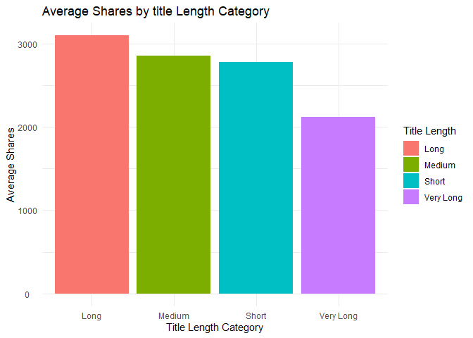

ST558: Project 2
================
Michael Bradshaw and Yejun Han
2023-07-07

- <a href="#channel-of-interest-entertainment"
  id="toc-channel-of-interest-entertainment">Channel of Interest:
  Entertainment</a>
  - <a href="#introduction-to-the-project"
    id="toc-introduction-to-the-project">Introduction to the Project</a>
  - <a href="#import-the-data" id="toc-import-the-data">Import the Data</a>
  - <a href="#splitting-the-data-into-test-and-training-datasets"
    id="toc-splitting-the-data-into-test-and-training-datasets">Splitting
    the data into test and training datasets</a>
  - <a href="#summarizations" id="toc-summarizations">Summarizations</a>
  - <a href="#modeling" id="toc-modeling">Modeling</a>

# Channel of Interest: Entertainment

## Introduction to the Project

The dataset used for this analysis focuses on the popularity of online
news articles, encompassing approximately 60 variables. These variables
include n_tokens_title, n_unique_tokens, num_imgs, num_videos,
average_token_length, num_keywords, weekday_is\_, is_weekend,
rate_positive_words, max_negative_polarity, title_subjectivity, and
shares. Our objective is to analyze the data and develop predictive
models with the shares variable as the target for each of six different
data channels.

To begin, we imported the news dataset and removed non-predictor
variables such as url and timedelta. Next, we conducted summarizations
of the data and explored specific variables such as day_of_week,
content_length, avg_positive_polarity, num_keywords, and the length of
the title. This analysis involved examining relevant summary statistics
and generating plots to gain insights.

In the modeling phase, we employed both linear regression models and
ensemble tree-based models. These models were applied to predict the
number of shares. We then compared the performance of the four created
models and selected the optimal model.

## Import the Data

In this section, we first import the raw online news popularity dataset.
We remove the non-predictor variables named url and timedelta. Next, we
create three new variables: the first is called *channel* based on the
values of the *data_channel_is\_* variables. The second new variable is
called *day_of_week* based on the values of the *weekday_is\_*
variables. The third new variable is called *content_length* based on
the values of the *n_tokens_content* variable. The *content_length
*variable is assigned values based on the conditionals provided,
categorizing the length of the content as “Very Short,” “Short,”
“Medium,” or “Long.”

Lastly, we subset the imported newsData into separate data frames for
each specific channel.

``` r
#Import the newsData csv file:
newsData <- read.csv(file="..//OnlineNewsPopularity//OnlineNewsPopularity.csv")

# Create single variable for data channel: 
newsData <- newsData %>% 
  dplyr::select(-url, -timedelta) %>%
  mutate(channel = ifelse(data_channel_is_lifestyle == 1, "Lifestyle",
                   ifelse(data_channel_is_entertainment == 1, "Entertainment",
                   ifelse(data_channel_is_bus == 1, "Business",
                   ifelse(data_channel_is_socmed == 1, "SocialMedia",
                   ifelse(data_channel_is_tech == 1, "Tech",
                   ifelse(data_channel_is_world == 1, "World", "Other")))))),
         day_of_week = ifelse(weekday_is_monday == 1, "Monday",
                       ifelse(weekday_is_tuesday == 1, "Tuesday",
                       ifelse(weekday_is_wednesday == 1, "Wednesday",
                       ifelse(weekday_is_thursday == 1, "Thursday",
                       ifelse(weekday_is_friday == 1, "Friday",
                       ifelse(weekday_is_saturday == 1, "Saturday", "Sunday")))))),
         content_length = ifelse(n_tokens_content <= 250, "Very Short",
                        ifelse(n_tokens_content <= 410, "Short",      
                        ifelse(n_tokens_content <= 750, "Medium", "Long"))),
         title_length = ifelse(n_tokens_title <= 8, "Short",
                               ifelse(n_tokens_title <= 12, "Medium",      
                               ifelse(n_tokens_title <= 15, "Long","Very Long"))),
         avg_positive_polarity_rate = ifelse(avg_positive_polarity <= 0.2, "Low",
                               ifelse(avg_positive_polarity <= 0.3, "Medium",      
                               ifelse(avg_positive_polarity <= 0.4, "High","Very High")))
         )

newsData$channel <- as.factor(newsData$channel) #Converting to factor
newsData$day_of_week <- factor(newsData$day_of_week,
                               levels = c("Sunday", "Monday", "Tuesday", 
                                          "Wednesday", "Thursday", 
                                          "Friday", "Saturday"))
newsData$content_length <- as.factor(newsData$content_length)
# Subset the data for each data channel
newsData_channel <- newsData %>% filter(channel == params$channel)
```

## Splitting the data into test and training datasets

This section creates training and test indices based on the *shares*
variable, and splits the data frames for each channel into separate
training and test sets for modeling.

``` r
# Set the seed for reproducibility
set.seed(717)

# Create the training and test indices
trainIndices <- createDataPartition(newsData_channel$shares, p = 0.7, list = FALSE)

# Split the data into training and test sets
train_Data <- newsData_channel[trainIndices, ]
test_Data <- newsData_channel[-trainIndices, ]
```

## Summarizations

In this first example, we look at a table summarizing the statistics of
the shares variable in our training dataset. We then create a histogram
to visualize the distribution of shares.

In a normal distribution,the histogram will have a symmetric shape with
a peak at the center and tails that extend symmetrically in both
directions. In a skewed distribution, the data can be either skewed to
the right or skewed to the left. In a right skewed distribution, the
histogram will have a long tail on the right side and a shorter tail on
the left side. The majority of observations will be concentrated on the
left side. In a left skewed distribution, the histogram will have a long
tail on the left side and a shorter tail on the right side, with the
majority of observations concentrated on the right side.

``` r
summary(train_Data$shares)
```

    ##    Min. 1st Qu.  Median    Mean 3rd Qu.    Max. 
    ##      47     833    1200    2893    2100  193400

``` r
# Histogram of shares
ggplot(train_Data , aes(x = shares)) +
  geom_histogram(binwidth = 2500, fill = "blue") +
  labs(x = "Shares", y = "Frequency") +
  ggtitle("Distribution of Shares") +
  theme_classic()
```

<!-- -->

In this second table, we display summary statistics for the shares
variable within our training dataset by day of the week. We display the
count (n), the total sum of shares (total_shares), the average shares
(average_shares), the standard deviation of shares (sd_shares), the
minimum shares (min_shares), and the maximum shares (max_shares) for
each group.

Next, we examine the is_weekend categorical variable by the shares
variable. We calculate the mean shares for each group (weekend
vs. non-weekend days).

Lastly, we create a bar plot to visualize the average shares by day of
the week. Higher bars indicate more shares on that day of the week.

``` r
#Shares by day of the week
average_shares <- train_Data %>%
  group_by(day_of_week) %>%
  summarise(n = n(),
            total_shares = sum(shares),
            average_shares = mean(shares),
            sd_shares = sd(shares),
            min_shares = min(shares),
            max_shares = max(shares))
average_shares
```

    ## # A tibble: 7 × 7
    ##   day_of_week     n total_shares average_shares sd_shares min_shares max_shares
    ##   <fct>       <int>        <int>          <dbl>     <dbl>      <int>      <int>
    ## 1 Sunday        358      1399076          3908.     6163.        536      69500
    ## 2 Monday        960      2609428          2718.     6272.         59      96000
    ## 3 Tuesday       893      2426851          2718.     6794.         47      98000
    ## 4 Wednesday     912      2653897          2910.     9059.         49     138700
    ## 5 Thursday      860      2269749          2639.     7805.         57     193400
    ## 6 Friday        684      1898065          2775.     5870.         58      82200
    ## 7 Saturday      274      1038578          3790.     7184.         65      68300

``` r
weekend_mean_shares <- train_Data %>%
  group_by(is_weekend) %>%
  rename(Weekend = is_weekend) %>%
  mutate(Weekend = ifelse(Weekend == 0, "No", "Yes")) %>%
  summarize(mean_shares = mean(shares))
  
weekend_mean_shares
```

    ## # A tibble: 2 × 2
    ##   Weekend mean_shares
    ##   <chr>         <dbl>
    ## 1 No            2752.
    ## 2 Yes           3857.

``` r
ggplot(average_shares, aes(x = day_of_week, y = average_shares, 
                           fill = day_of_week)) +
  geom_col() +
  labs(x = "Day of the Week", y = "Average Shares", fill = "Day of the Week") +
  ggtitle("Average Shares by Day of the Week") +
  theme_classic() +
  theme(axis.text.x = element_text(angle = 45, hjust = 1))
```

<!-- -->

These tables display the average number of shares for different content
length categories. Summary statistics such as the count of observations,
the average number of shares, the standard deviation of shares, the
minimum number of shares (min_shares), and the maximum number of shares
(max_shares), and the range of shares (range_shares) are computed for
each content length category.

Next, a horizontal bar chart is created to help us visualize these
results by showing the average number of shares on the x-axis and the
content length categories (content_length) on the y-axis.

``` r
# Calculate the average shares by content length category
average_shares_byContent <- train_Data %>%
  group_by(content_length) %>%
  summarise(n = n(),
            average_shares = mean(shares),
            sd_shares = sd(shares),
            min_shares = min(shares),
            max_shares = max(shares),
            range_shares = max_shares - min_shares)
average_shares_byContent
```

    ## # A tibble: 4 × 7
    ##   content_length     n average_shares sd_shares min_shares max_shares range_shares
    ##   <fct>          <int>          <dbl>     <dbl>      <int>      <int>        <int>
    ## 1 Long            1384          2875.     6498.        138      96000        95862
    ## 2 Medium          1212          2754.     7477.         51     138700       138649
    ## 3 Short           1161          2590.     5207.         47      98000        97953
    ## 4 Very Short      1184          3356.     9191.         49     193400       193351

``` r
# Create the horizontal bar chart
ggplot(average_shares_byContent, aes(x = average_shares, y = content_length, fill = content_length)) +
  geom_bar(stat = "identity") +
  labs(x = "Average Shares", y = "Content Length Category", fill = "Content Length") +
  ggtitle("Average Shares by Content Length Category") +
  theme_minimal() +
  theme(axis.text.y = element_text(hjust = 0.5))
```

<!-- -->

To analyze the relationship between avg_positive_polarity and
average_shares, the continuous numeric data of avg_positive_polarity was
transformed into categorical data using the variable
avg_positive_polarity_rate, which includes the categories “Low,”
“Medium,” “High,” and “Very High.”

Interestingly, it was observed that articles with a “Low”
avg_positive_polarity_rate displayed the highest average number of
shares. On the other hand, articles with “High” and “Medium”
avg_positive_polarity_rate showed similar average share counts.

``` r
# Calculate the average shares by avg_positive_polarity_rate category
average_shares_byavg_positive_polarity_rate <- train_Data %>%
  group_by(avg_positive_polarity_rate) %>%
  summarise(n = n(),
            average_shares = mean(shares),
            sd_shares = sd(shares),
            min_shares = min(shares),
            max_shares = max(shares),
            range_shares = max_shares - min_shares)
average_shares_byavg_positive_polarity_rate
```

    ## # A tibble: 4 × 7
    ##   avg_positive_polarity_rate     n average_shares sd_shares min_shares max_shares
    ##   <chr>                      <int>          <dbl>     <dbl>      <int>      <int>
    ## 1 High                        2300          2824.     7261.         58     138700
    ## 2 Low                          240          3054.     5863.        360      57500
    ## 3 Medium                       682          2471.     5032.         47      82200
    ## 4 Very High                   1719          3131.     8037.         51     193400
    ## # ℹ 1 more variable: range_shares <int>

``` r
# Create the horizontal bar chart
ggplot(average_shares_byavg_positive_polarity_rate, aes(x = avg_positive_polarity_rate, y = average_shares, fill = avg_positive_polarity_rate)) +
  geom_bar(stat = "identity") +
  labs(x = "avg_positive_polarity_rate Category", y = "Average Shares", fill = "avg_positive_polarity_rate") +
  ggtitle("Average Shares by avg_positive_polarity_rate Category") +
  theme_minimal() +
  theme(axis.text.y = element_text(hjust = 0.6))
```

<!-- -->

For articles with less than 8 keywords, this summary plot shows an
increasing trend in average shares as the number of keywords increases,
except for cases where there are exactly 5 keywords. However, when the
number of keywords exceeds 8, the plot indicates a gradual decrease in
average shares.

This suggests that articles with a moderate number of keywords tend to
have higher average shares.

``` r
# Calculate the average shares by number of keywords
average_shares_bynum_keywords <- train_Data %>%
  group_by(num_keywords) %>%
  summarise(n = n(),
            average_shares = mean(shares),
            sd_shares = sd(shares),
            min_shares = min(shares),
            max_shares = max(shares),
            range_shares = max_shares - min_shares)
average_shares_bynum_keywords
```

    ## # A tibble: 9 × 7
    ##   num_keywords     n average_shares sd_shares min_shares max_shares range_shares
    ##          <dbl> <int>          <dbl>     <dbl>      <int>      <int>        <int>
    ## 1            2     1           731        NA         731        731            0
    ## 2            3    63          2083.     3404.         57      20000        19943
    ## 3            4   468          2066.     4403.         59      53100        53041
    ## 4            5   772          2663.     6016.         58      82200        82142
    ## 5            6   939          2417.     5296.         49     109500       109451
    ## 6            7   848          3541.     9550.        109     138700       138591
    ## 7            8   691          2909.     6294.         88      98000        97912
    ## 8            9   487          4153.    11910.         47     193400       193353
    ## 9           10   672          2733.     5265.         80      87600        87520

``` r
# Create the horizontal bar chart
ggplot(average_shares_bynum_keywords, aes(x = num_keywords, y = average_shares, fill = num_keywords)) +
  geom_bar(stat = "identity") +
  labs(x = "num_keywords", y = "Average Shares", fill = "num_keywords") +
  ggtitle("Average Shares by number of keywords") +
  theme_minimal() +
  theme(axis.text.y = element_text(hjust = 0.5))
```

<!-- -->

In addition to analyzing the effect of content length on average_shares,
we also examined the impact of title length on this variable. By
plotting average_shares against the length of the title, we observed
several interesting trends.

The plot revealed that titles with a medium length exhibited the highest
average number of shares. Surprisingly, the average shares for titles of
long and short length were only slightly lower than those of
medium-length titles. However, it is evident that very long titles have
a negative effect on the average number of shares.

These findings suggest that maintaining a moderate length for article
titles is associated with higher average shares, while excessively long
titles may have a detrimental impact on the article’s shareability.

``` r
# Calculate the average shares by title length category
average_shares_byTitle <- train_Data %>%
  group_by(title_length) %>%
  summarise(n = n(),
            average_shares = mean(shares),
            sd_shares = sd(shares),
            min_shares = min(shares),
            max_shares = max(shares),
            range_shares = max_shares - min_shares)
average_shares_byTitle
```

    ## # A tibble: 4 × 7
    ##   title_length     n average_shares sd_shares min_shares max_shares range_shares
    ##   <chr>        <int>          <dbl>     <dbl>      <int>      <int>        <int>
    ## 1 Long          1141          3098.     7979.         49     109100       109051
    ## 2 Medium        3175          2859.     7307.         49     193400       193351
    ## 3 Short          544          2777.     5292.         47      68300        68253
    ## 4 Very Long       81          2117.     2533.        242      15600        15358

``` r
# Create the horizontal bar chart
ggplot(average_shares_byTitle, aes(x = title_length, y = average_shares, fill = title_length)) +
  geom_bar(stat = "identity") +
  labs(x = "Title Length Category", y = "Average Shares", fill = "Title Length") +
  ggtitle("Average Shares by title Length Category") +
  theme_minimal() +
  theme(axis.text.y = element_text(hjust = 0.5))
```

<!-- -->

## Modeling

### Linear Regression Models

Linear regression is a modeling technique that attempts to form a linear
relationship between a response (dependent variable (i.e. shares)) and
one or more predictor (independent variables). In simple linear
regression, there is one predictor or independent variable as opposed to
multiple linear regression where there are multiple predictors. Linear
regression seeks to explain the values of our response variable based on
our predictor variables by fitting a straight line to the data that
minimizes the sum of the squared differences between the observed and
predicted values.

Our online news dataset contains a large number of predictors and we
don’t have a great sense of their relationship to the shares variable.
These relationships may change between data channels as well. If we look
at correlations between shares and the rest of the possible numeric
variables, we see a mix of small positive relationship, small negative
relationships, and some with little to no relationship.

``` r
# Calculate correlations between shares and all numeric variables
correlations <- cor(train_Data[, sapply(train_Data, is.numeric)], 
                    train_Data$shares)
correlations
```

    ##                                        [,1]
    ## n_tokens_title                 0.0082025078
    ## n_tokens_content              -0.0099358129
    ## n_unique_tokens                0.0060525446
    ## n_non_stop_words               0.0058585890
    ## n_non_stop_unique_tokens       0.0057499767
    ## num_hrefs                      0.0463818864
    ## num_self_hrefs                -0.0040597561
    ## num_imgs                       0.0452642152
    ## num_videos                     0.0005214405
    ## average_token_length           0.0103222753
    ## num_keywords                   0.0455185020
    ## data_channel_is_lifestyle                NA
    ## data_channel_is_entertainment            NA
    ## data_channel_is_bus                      NA
    ## data_channel_is_socmed                   NA
    ## data_channel_is_tech                     NA
    ## data_channel_is_world                    NA
    ## kw_min_min                     0.0002161344
    ## kw_max_min                     0.0067707745
    ## kw_avg_min                     0.0035846768
    ## kw_min_max                    -0.0027346618
    ## kw_max_max                     0.0129599116
    ## kw_avg_max                     0.0423079591
    ## kw_min_avg                     0.0241892312
    ## kw_max_avg                     0.0838594227
    ## kw_avg_avg                     0.1245978606
    ## self_reference_min_shares      0.1159582698
    ## self_reference_max_shares      0.0786395307
    ## self_reference_avg_sharess     0.1330038136
    ## weekday_is_monday             -0.0119032551
    ## weekday_is_tuesday            -0.0114185035
    ## weekday_is_wednesday           0.0011001656
    ## weekday_is_thursday           -0.0161416172
    ## weekday_is_friday             -0.0065650606
    ## weekday_is_saturday            0.0300904887
    ## weekday_is_sunday              0.0392585302
    ## is_weekend                     0.0510916208
    ## LDA_00                        -0.0289428353
    ## LDA_01                        -0.0201822507
    ## LDA_02                        -0.0262798352
    ## LDA_03                         0.0382017534
    ## LDA_04                        -0.0041387574
    ## global_subjectivity            0.0300187894
    ## global_sentiment_polarity      0.0155998871
    ## global_rate_positive_words    -0.0334521379
    ## global_rate_negative_words    -0.0131454062
    ## rate_positive_words           -0.0060175894
    ## rate_negative_words            0.0008146931
    ## avg_positive_polarity          0.0185136826
    ## min_positive_polarity          0.0239526322
    ## max_positive_polarity          0.0027406734
    ## avg_negative_polarity         -0.0012964950
    ## min_negative_polarity          0.0080679634
    ## max_negative_polarity          0.0012686628
    ## title_subjectivity             0.0125873128
    ## title_sentiment_polarity      -0.0039697509
    ## abs_title_subjectivity         0.0039264613
    ## abs_title_sentiment_polarity   0.0156540906
    ## shares                         1.0000000000

In general, we see that the number of videos (num_videos), the number of
images (num_imgs) and the number of links (num_hrefs) have small
positive correlations. We also know from our descriptive analysis that
day of the week seems to influence the number of shares as well, but to
eliminate redundancy lets remove the weekday_is variables and the
is_weekend variables. Other variables that we might expect to influence
number of shares include the number of words in the title
(n_tokens_title), and the number of words in the content
(n_tokens_content). The LDA topic also appears correlated across
different data channels, so let’s include all of these variables since
they probably vary across different data channels. Lastly, in the
overall news dataset we notice that average keyword (kw_avg_avg) had a
positive correlation with shares, so let’s keep this in our model.

We can also remove all the data_channel variables as this information is
not needed within each data channel analysis.

``` r
# subset the data: 
train_Data_model <- dplyr::select(train_Data, shares, num_videos, n_tokens_content, n_tokens_title, num_imgs, num_hrefs, self_reference_min_shares, LDA_00, LDA_01, LDA_02, LDA_03, LDA_04, kw_avg_avg,day_of_week)

# all predictors from our subset:
lm_fit1 <- train(shares ~ . , data = train_Data_model, 
                            method = "lm", preProcess = c("center", "scale"),
                            trControl = trainControl(method = "cv", number = 5))
```

Here, we assess how well our first linear model fits the data based on
the ability to accurately predict the shares variable. The RMSE provides
an evaluation of the model’s performance.

``` r
# check the fit of our first linear model:
predslinear1 <- predict(lm_fit1, newdata = test_Data)
# See how well the model fits
postResample(predslinear1, obs = test_Data$shares)
```

    ##         RMSE     Rsquared          MAE 
    ## 9.036236e+03 2.897444e-02 3.001302e+03

Now, let’s suppose we were way off with all of our assumptions in terms
of the key variables to include. Let’s try a different approach and use
the leapSeq algorithm. This approach evaluates different subsets of
features to determine the subset that produces the best model
performance. And in this situation, we can do this with all of the
possible predictor variables, not just our subset of key variables. This
may require more computational power, so let’s do parallel processing.

``` r
# Parallel Processing
num_cores <- detectCores()-1
cl <- makeCluster(num_cores)
registerDoParallel(cl)

step_model_seq <- train(shares ~ . , data = train_Data, 
                 method = "leapSeq", preProcess = c("center", "scale"),
                 tuneGrid = data.frame(nvmax = 1:10), # up to 10 predictors max
                 trControl = trainControl(method = "cv", number = 5))
```

    ## Reordering variables and trying again:

``` r
step_model_seq$results
```

    ##    nvmax      RMSE     Rsquared      MAE   RMSESD   RsquaredSD    MAESD
    ## 1      1  7141.255 0.0025287789 2827.201 1262.147 0.0040624004 138.2063
    ## 2      2  7140.730 0.0005161616 2827.200 1259.047 0.0007212553 133.9755
    ## 3      3  7108.320 0.0100172942 2788.401 1250.657 0.0068332876 102.0010
    ## 4      4  7112.025 0.0093139312 2781.214 1248.482 0.0063684318 104.4817
    ## 5      5  7117.245 0.0089572746 2784.587 1245.544 0.0065982052 104.8238
    ## 6      6  7112.530 0.0114470293 2775.589 1249.612 0.0121350538 113.4971
    ## 7      7  7130.064 0.0057569802 2787.951 1233.106 0.0043865809 100.6897
    ## 8      8  7115.174 0.0107040907 2773.086 1250.801 0.0106070168 114.3940
    ## 9      9  7094.103 0.0145962437 2766.777 1241.329 0.0091848236 111.6179
    ## 10    10 10254.881 0.0119018466 2929.345 8120.490 0.0103175340 462.8414

``` r
step_model_seq$bestTune
```

    ##   nvmax
    ## 9     9

``` r
# Stop parallel processing
stopCluster(cl)
registerDoSEQ()
```

Here, we assess how well our second linear model fits the data based on
the ability to accurately predict the shares variable. The RMSE provides
an evaluation of the model’s performance.

``` r
predslinear2 <- predict(step_model_seq, newdata = test_Data)
# See how well the model fits
postResample(predslinear2, obs = test_Data$shares)
```

    ##         RMSE     Rsquared          MAE 
    ## 8.961344e+03 7.001026e-02 2.987983e+03

### Ensemble Tree-Based Models

### Random Forest Model:

Random Forest is an ensemble learning technique that uses decision tress
to make predictions. The idea is to construct an ensemble of decision
trees by training each tree on a random subset of the data and a random
subset of the predictors. Each individual tree independently make
predictions, but the final prediction is determined by aggregating the
results.

``` r
# Parallel Processing
num_cores <- detectCores()-1
cl <- makeCluster(num_cores)
registerDoParallel(cl)

rfFit <- train(shares ~ ., data = train_Data_model, method = "rf",
               trControl = trainControl(method = "cv", number = 5, repeats = 3),
               preProcess = c("center", "scale"),
               tuneGrid = data.frame(mtry = c(1:10)))

# Stop parallel processing
stopCluster(cl)
registerDoSEQ()

#review results:
rfFit$results
```

    ##    mtry     RMSE   Rsquared      MAE   RMSESD  RsquaredSD    MAESD
    ## 1     1 6889.201 0.03605135 2743.894 2020.938 0.012458608 279.7617
    ## 2     2 6894.172 0.03623901 2788.199 1952.721 0.010082692 268.8043
    ## 3     3 6918.428 0.03584069 2814.169 1912.021 0.008604337 267.8573
    ## 4     4 6966.234 0.03189461 2843.613 1867.874 0.009551549 260.2277
    ## 5     5 6987.077 0.03137227 2865.997 1843.509 0.009454043 257.9574
    ## 6     6 7016.407 0.02940863 2890.895 1853.481 0.007116829 274.8287
    ## 7     7 7042.351 0.02759359 2901.652 1840.920 0.007937199 271.7191
    ## 8     8 7069.559 0.02723153 2919.786 1813.775 0.006469195 264.9758
    ## 9     9 7105.573 0.02457779 2942.551 1798.324 0.007594640 269.5126
    ## 10   10 7133.460 0.02322473 2954.320 1808.385 0.006566566 279.7535

``` r
rfFit$bestTune
```

    ##   mtry
    ## 1    1

Finally, we make predictions on test data using the trained Random
Forest model. The model fit diagnostics compares the predicted values
with the observed shares values from the test data. The RMSE provides an
evaluation of the model’s performance.

``` r
# Make predictions with random forest model
predsRf <- predict(rfFit, newdata = test_Data)
# Check model fit diagnostics
postResample(predsRf, obs = test_Data$shares)
```

    ##         RMSE     Rsquared          MAE 
    ## 9.106214e+03 1.429962e-02 3.031559e+03

### Boosted tree model:

Boosted tree model, also known as gradient boosting, combines multiple
weak prediction models to create a stronger and more accurate model.
Each tree is dependent on prior trees, i.e. fitting the residual of the
trees that preceded it, and improve the final accuracy.

``` r
# Boosted: Define the control parameters for cross-validation  
ctrl <- trainControl(method = "cv", number = 5)

# Define the tuning parameters:
boosted_grid <- expand.grid(n.trees = c(25, 50, 100, 150, 200),
                            interaction.depth = c(1, 2, 3, 4),
                            shrinkage = 0.1,
                            n.minobsinnode = 10)

# Specify the boosted tree model using the gbm package

# Set the number of CPU cores to use
num_cores <- detectCores()-1
# Set up parallel processing
cl <- makeCluster(num_cores)
registerDoParallel(cl)
boostFit <- train(shares ~ ., data = lifestyle_train_Data_model,
                       method = "gbm",
                       trControl = trainControl(method = "repeatedcv", 
                                                number = 5, repeats = 3),
                       tuneGrid = boosted_grid,
                       #suppress output
                       verbose = FALSE )
# Stop parallel processing
stopCluster(cl)
registerDoSEQ()
```

Then, the boosted tree model was evaluated by assessing its performance
on the test data.

``` r
# Make predictions with Boosted tree model
predsBf <- predict(boostFit, newdata = test_Data)

# Check model fit diagnostics
postResample(predsBf, obs = test_Data$shares)
```

    ##         RMSE     Rsquared          MAE 
    ## 9.555329e+03 1.931476e-04 4.081400e+03

### Comparison of Models

In this section, we will compare the performance of our four models: 1)
linear regression (subset of predictors), 2) linear regression (all
predictors, leap approach) 3) random forest, and 4) boosted tree. We
will evaluate the models using the test set with a focus on predictive
accuracy measured by the lowest Root Mean Squared Error (RMSE).

``` r
# Function to determine the best model
find_best <- function(lm1, lm2, rf, boost){
  # Put all the fit results in a data frame
  results <- data.frame(rbind("Linear Model 1"= postResample(lm1, test_Data$shares),
                                  "Linear Model 2"= postResample(lm2, test_Data$shares),
                                  "Random Forest"= postResample(rf, test_Data$shares),
                                  "Boosted Tree" = postResample(boost, test_Data$shares)))

  # Determine the name of the model with the lowest RMSE
  model_winner <- row.names(results)[results$RMSE == min(results$RMSE)]
  # Return both the data frame of results, as well as the row name of best model name in a list
  return(list(results, model_winner))
}

# search through to find the best model
best_model <- find_best(predslinear1, predslinear2, predsRf, predsBf)
# Print out the data frame of RMSE, Rsquared, and MAE
best_model[[1]]
```

    ##                    RMSE     Rsquared      MAE
    ## Linear Model 1 9036.236 0.0289744450 3001.302
    ## Linear Model 2 8961.344 0.0700102610 2987.983
    ## Random Forest  9106.214 0.0142996236 3031.559
    ## Boosted Tree   9555.329 0.0001931476 4081.400

``` r
# Print out a message that tells us which model is the best based on lowest RMSE
print(paste("The best model for the", params$channel, "data channel, determined by the lowest RMSE on the test data, is the", best_model[[2]], "model."))
```

    ## [1] "The best model for the Entertainment data channel, determined by the lowest RMSE on the test data, is the Linear Model 2 model."
