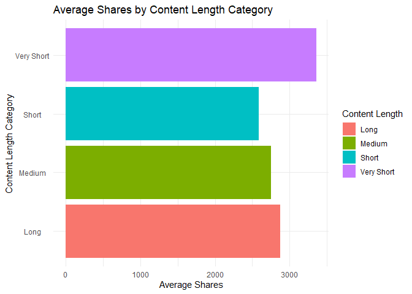

ST558: Project 2
================
Michael Bradshaw and Yejun Han
2023-07-04

- <a href="#channel-of-interest-entertainment"
  id="toc-channel-of-interest-entertainment">Channel of Interest:
  Entertainment</a>
  - <a href="#introduction-to-the-project-to-be-completed-by-yejun"
    id="toc-introduction-to-the-project-to-be-completed-by-yejun">Introduction
    to the Project (To be Completed by Yejun)</a>
  - <a href="#import-the-data" id="toc-import-the-data">Import the Data</a>
  - <a href="#split-the-data-just-setting-an-example-up---not-final"
    id="toc-split-the-data-just-setting-an-example-up---not-final">Split the
    data (Just setting an example up - not final)</a>
  - <a href="#summarizations-both-michael-and-yejun"
    id="toc-summarizations-both-michael-and-yejun">Summarizations (Both
    Michael and Yejun)</a>
  - <a href="#modeling-both-michael-and-yejun"
    id="toc-modeling-both-michael-and-yejun">Modeling (Both Michael and
    Yejun)</a>

# Channel of Interest: Entertainment

## Introduction to the Project (To be Completed by Yejun)

## Import the Data

In this section, we first import the raw online news popularity dataset.
We remove the non-predictor variables named url and timedelta. Next, we
create three new variables: the first is called *channel* based on the
values of the *data_channel_is\_* variables. The second new variable is
called *day_of_week* based on the values of the *weekday_is\_*
variables. The third new variable is called *content_length* based on
the values of the *n_tokens_content* variable. The *content_length
*variable is assigned values based on the conditionals provided,
categorizing the length of the content as “Very Short,” “Short,”
“Medium,” or “Long.”

Lastly, we subset the imported newsData into separate data frames for
each specific channel.

``` r
#Import the newsData csv file:
newsData <- read.csv(file="..//OnlineNewsPopularity//OnlineNewsPopularity.csv")

# Create single variable for data channel: 
newsData <- newsData %>% 
  select(-url, -timedelta) %>%
  mutate(channel = ifelse(data_channel_is_lifestyle == 1, "Lifestyle",
                   ifelse(data_channel_is_entertainment == 1, "Entertainment",
                   ifelse(data_channel_is_bus == 1, "Business",
                   ifelse(data_channel_is_socmed == 1, "SocialMedia",
                   ifelse(data_channel_is_tech == 1, "Tech",
                   ifelse(data_channel_is_world == 1, "World", "Other")))))),
         day_of_week = ifelse(weekday_is_monday == 1, "Monday",
                       ifelse(weekday_is_tuesday == 1, "Tuesday",
                       ifelse(weekday_is_wednesday == 1, "Wednesday",
                       ifelse(weekday_is_thursday == 1, "Thursday",
                       ifelse(weekday_is_friday == 1, "Friday",
                       ifelse(weekday_is_saturday == 1, "Saturday", "Sunday")))))),
         content_length = ifelse(n_tokens_content <= 250, "Very Short",
                        ifelse(n_tokens_content <= 410, "Short",      
                        ifelse(n_tokens_content <= 750, "Medium", "Long")))
         )
newsData$channel <- as.factor(newsData$channel) #Converting to factor
newsData$day_of_week <- factor(newsData$day_of_week,
                               levels = c("Sunday", "Monday", "Tuesday", 
                                          "Wednesday", "Thursday", 
                                          "Friday", "Saturday"))
newsData$content_length <- as.factor(newsData$content_length)
# Subset the data for the data channel of interest:
newsData_channel <- newsData %>% filter(channel == params$channel)
```

## Split the data (Just setting an example up - not final)

This section creates training and test indices based on the “shares”
variable, and splits the data frames for each channel into separate
training and test sets for modeling.

``` r
# Set the seed for reproducibility
set.seed(717)

# Create the training and test indices
trainIndices <- createDataPartition(newsData_channel$shares, p = 0.7, list = FALSE)

# Split the data into training and test sets
train_Data <- newsData_channel[trainIndices, ]
test_Data <- newsData_channel[-trainIndices, ]
```

## Summarizations (Both Michael and Yejun)

In this first example, we look at a table summarizing the statistics of
the shares variable in our training dataset. We then create a histogram
to visualize the distribution of shares.

In a normal distribution,the histogram will have a symmetric shape with
a peak at the center and tails that extend symmetrically in both
directions. In a skewed distribution, the data can be either skewed to
the right or skewed to the left. In a right skewed distribution, the
histogram will have a long tail on the right side and a shorter tail on
the left side. The majority of observations will be concentrated on the
left side. In a left skewed distribution, the histogram will have a long
tail on the left side and a shorter tail on the right side, with the
majority of observations concentrated on the right side.

``` r
summary(train_Data$shares)
```

    ##    Min. 1st Qu.  Median    Mean 3rd Qu.    Max. 
    ##      47     833    1200    2893    2100  193400

``` r
# Histogram of shares
ggplot(train_Data , aes(x = shares)) +
  geom_histogram(binwidth = 2500, fill = "blue") +
  labs(x = "Shares", y = "Frequency") +
  ggtitle("Distribution of Shares") +
  theme_classic()
```

<!-- -->

In this second table, we display summary statistics for the shares
variable within our training dataset by day of the week. We display the
count (n), the total sum of shares (total_shares), the average shares
(average_shares), the standard deviation of shares (sd_shares), the
minimum shares (min_shares), and the maximum shares (max_shares) for
each group.

Next, we examine the is_weekend categorical variable by the shares
variable. We calculate the mean shares for each group (weekend
vs. non-weekend days).

Lastly, we create a bar plot to visualize the average shares by day of
the week. Higher bars indicate more shares on that day of the week.

``` r
#Shares by day of the week
average_shares <- train_Data %>%
  group_by(day_of_week) %>%
  summarise(n = n(),
            total_shares = sum(shares),
            average_shares = mean(shares),
            sd_shares = sd(shares),
            min_shares = min(shares),
            max_shares = max(shares))
average_shares
```

    ## # A tibble: 7 × 7
    ##   day_of_week     n total_shares average_shares sd_shares min_shares max_shares
    ##   <fct>       <int>        <int>          <dbl>     <dbl>      <int>      <int>
    ## 1 Sunday        358      1399076          3908.     6163.        536      69500
    ## 2 Monday        960      2609428          2718.     6272.         59      96000
    ## 3 Tuesday       893      2426851          2718.     6794.         47      98000
    ## 4 Wednesday     912      2653897          2910.     9059.         49     138700
    ## 5 Thursday      860      2269749          2639.     7805.         57     193400
    ## 6 Friday        684      1898065          2775.     5870.         58      82200
    ## 7 Saturday      274      1038578          3790.     7184.         65      68300

``` r
weekend_mean_shares <- train_Data %>%
  group_by(is_weekend) %>%
  rename(Weekend = is_weekend) %>%
  mutate(Weekend = ifelse(Weekend == 0, "No", "Yes")) %>%
  summarize(mean_shares = mean(shares))
  
weekend_mean_shares
```

    ## # A tibble: 2 × 2
    ##   Weekend mean_shares
    ##   <chr>         <dbl>
    ## 1 No            2752.
    ## 2 Yes           3857.

``` r
ggplot(average_shares, aes(x = day_of_week, y = average_shares, 
                           fill = day_of_week)) +
  geom_col() +
  labs(x = "Day of the Week", y = "Average Shares", fill = "Day of the Week") +
  ggtitle("Average Shares by Day of the Week") +
  theme_classic() +
  theme(axis.text.x = element_text(angle = 45, hjust = 1))
```

<!-- -->

These tables display the average number of shares for different content
length categories. Summary statistics such as the count of observations,
the average number of shares, the standard deviation of shares, the
minimum number of shares (min_shares), and the maximum number of shares
(max_shares), and the range of shares (range_shares) are computed for
each content length category.

Next, a horizontal bar chart is created to help us visualize these
results by showing the average number of shares on the x-axis and the
content length categories (content_length) on the y-axis.

``` r
# Calculate the average shares by content length category
average_shares_byContent <- train_Data %>%
  group_by(content_length) %>%
  summarise(n = n(),
            average_shares = mean(shares),
            sd_shares = sd(shares),
            min_shares = min(shares),
            max_shares = max(shares),
            range_shares = max_shares - min_shares)
average_shares_byContent
```

    ## # A tibble: 4 × 7
    ##   content_length     n average_shares sd_shares min_shares max_shares
    ##   <fct>          <int>          <dbl>     <dbl>      <int>      <int>
    ## 1 Long            1384          2875.     6498.        138      96000
    ## 2 Medium          1212          2754.     7477.         51     138700
    ## 3 Short           1161          2590.     5207.         47      98000
    ## 4 Very Short      1184          3356.     9191.         49     193400
    ## # ℹ 1 more variable: range_shares <int>

``` r
# Create the horizontal bar chart
ggplot(average_shares_byContent, aes(x = average_shares, y = content_length, fill = content_length)) +
  geom_bar(stat = "identity") +
  labs(x = "Average Shares", y = "Content Length Category", fill = "Content Length") +
  ggtitle("Average Shares by Content Length Category") +
  theme_minimal() +
  theme(axis.text.y = element_text(hjust = 0.5))
```

<!-- -->

**Yejun to add more.**

## Modeling (Both Michael and Yejun)

Each group member should contribute a linear regression model and an
ensemble tree-based model.

### Linear Regression Models

Linear regression is a modeling technique that forms a linear
relationship between a dependent variable (i.e. shares) and one or more
independent variables. In simple linear regression, there is one
predictor or independent variable as opposed to multiple linear
regression where there are multiple predictors. Linear regression seeks
to explain the values of our response variable based on our predictor
variables by fitting a straight line to the data that minimizes the sum
of the squared differences between the observed and predicted values.

``` r
# all predictors
lm_fit1 <- train(shares ~ . , data = train_Data, 
                            method = "lm", preProcess = c("center", "scale"),
                            trControl = trainControl(method = "cv", number = 5))
```

### Ensemble Tree-Based

### Random Forest Model:

Random Forest is an ensemble learning technique. It constructs an
ensemble of decision trees by training each tree on a random subset of
the data and a random subset of the predictors. The individual trees
independently make predictions, and the final prediction is determined
by aggregating the results. This approach enhances model performance by
reducing overfitting and improving generalization. Random Forest is
applicable to both classification and regression problems and is known
for its ability to handle large datasets, high-dimensional feature
spaces, and capture complex relationships between variables.

``` r
rfFit <- train(shares ~ ., data = train_Data, method = "rf",
               trControl = trainControl(method = "cv", 
                                        number = 5, repeats = 3),
               preProcess = c("center", "scale"),
               tuneGrid = data.frame(mtry =
                                    c(1:ncol(train_Data_model)/3)))
```

### Comparison of Models
