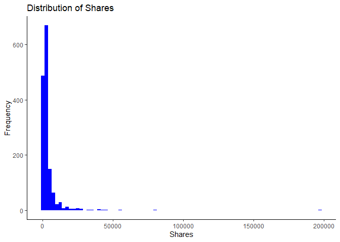

ST558: Project 2
================
Michael Bradshaw and Yejun Han
2023-06-30

- <a href="#01-introduction-to-the-project-to-be-completed-by-yejun"
  id="toc-01-introduction-to-the-project-to-be-completed-by-yejun">0.1
  Introduction to the Project (To be Completed by Yejun)</a>
- <a href="#02-import-the-data" id="toc-02-import-the-data">0.2 Import the
  Data</a>
- <a href="#03-split-the-data-just-setting-an-example-up---not-final"
  id="toc-03-split-the-data-just-setting-an-example-up---not-final">0.3
  Split the data (Just setting an example up - not final)</a>
- <a href="#04-summarizations-both-michael-and-yejun---example-shown"
  id="toc-04-summarizations-both-michael-and-yejun---example-shown">0.4
  Summarizations (Both Michael and Yejun) - example shown</a>
- <a href="#05-modeling-both-michael-and-yejun"
  id="toc-05-modeling-both-michael-and-yejun">0.5 Modeling (Both Michael
  and Yejun)</a>
  - <a href="#051-linear-regression-models"
    id="toc-051-linear-regression-models">0.5.1 Linear Regression Models</a>
  - <a href="#052-ensemble-tree-based-models"
    id="toc-052-ensemble-tree-based-models">0.5.2 Ensemble Tree-Based
    Models</a>
  - <a href="#053-comparison-of-models"
    id="toc-053-comparison-of-models">0.5.3 Comparison of Models</a>

## 0.1 Introduction to the Project (To be Completed by Yejun)

## 0.2 Import the Data

``` r
#Import the newsData csv file:
newsData <- read.csv(file="..//OnlineNewsPopularity//OnlineNewsPopularity.csv")

# Create single variable for data channel: 
newsData <- newsData %>% 
  mutate(channel = ifelse(data_channel_is_lifestyle == 1, "Lifestyle",
                   ifelse(data_channel_is_entertainment == 1, "Entertainment",
                   ifelse(data_channel_is_bus == 1, "Business",
                   ifelse(data_channel_is_socmed == 1, "SocialMedia",
                   ifelse(data_channel_is_tech == 1, "Tech",
                   ifelse(data_channel_is_world == 1, "World", "Other")))))))
newsData$channel <- as.factor(newsData$channel) #Converting to factor

# Subset the data for each data channel
lifestyleData <- filter(newsData, channel == "Lifestyle")
entertainmentData <- filter(newsData, channel == "Entertainment")
businessData <- filter(newsData, channel == "Business")
socmedData <- filter(newsData, channel == "SocialMedia")
techData <- filter(newsData, channel == "Tech")
worldData <- filter(newsData, channel == "World")
otherData <- filter(newsData, channel == "Other")
```

## 0.3 Split the data (Just setting an example up - not final)

``` r
# Set the seed for reproducibility
set.seed(717)

# Create the training and test indices
trainIndices <- createDataPartition(lifestyleData$shares, p = 0.7, list = FALSE)

# Split the data into training and test sets
lifestyle_train_Data <- lifestyleData[trainIndices, ]
lifestyle_test_Data <- lifestyleData[-trainIndices, ]
```

## 0.4 Summarizations (Both Michael and Yejun) - example shown

``` r
summary(lifestyle_train_Data$shares)
```

    ##    Min. 1st Qu.  Median    Mean 3rd Qu.    Max. 
    ##      28    1100    1700    3462    3225  196700

``` r
# Histogram of shares
ggplot(lifestyle_train_Data , aes(x = shares)) +
  geom_histogram(binwidth = 2500, fill = "blue") +
  labs(x = "Shares", y = "Frequency") +
  ggtitle("Distribution of Shares") +
  theme_classic()
```

<!-- -->

**Each group member is responsible for producing some summary statistics
(means, sds, contingencytables, etc.) and for producing at least three
graphs (each) of the data.**

## 0.5 Modeling (Both Michael and Yejun)

Each group member should contribute a linear regression model and an
ensemble tree-based model.

### 0.5.1 Linear Regression Models

### 0.5.2 Ensemble Tree-Based Models

### 0.5.3 Comparison of Models
