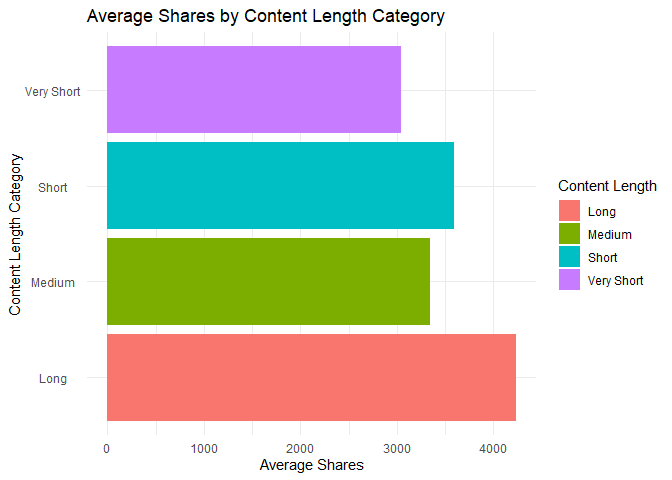
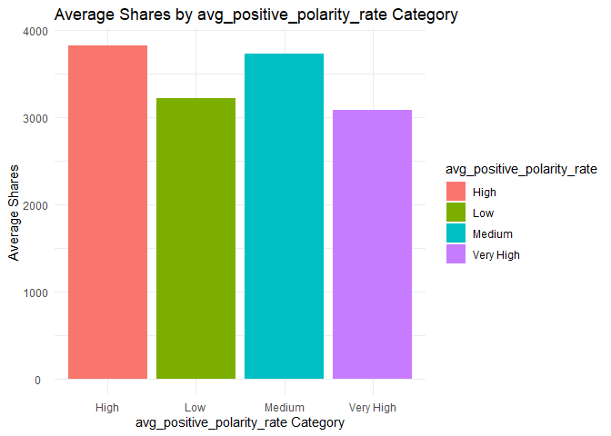

ST558: Project 2
================
Michael Bradshaw and Yejun Han
2023-07-09

- <a href="#channel-of-interest-socialmedia"
  id="toc-channel-of-interest-socialmedia">Channel of Interest:
  SocialMedia</a>
  - <a href="#introduction-to-the-project"
    id="toc-introduction-to-the-project">Introduction to the Project</a>
  - <a href="#import-the-data" id="toc-import-the-data">Import the Data</a>
  - <a href="#splitting-the-data-into-test-and-training-datasets"
    id="toc-splitting-the-data-into-test-and-training-datasets">Splitting
    the data into test and training datasets</a>
  - <a href="#summarizations" id="toc-summarizations">Summarizations</a>
  - <a href="#modeling" id="toc-modeling">Modeling</a>
  - <a href="#comparison-of-models" id="toc-comparison-of-models">Comparison
    of Models</a>

# Channel of Interest: SocialMedia

## Introduction to the Project

The dataset used for this analysis focuses on the popularity of online
news articles, encompassing approximately 60 variables. These variables
include n_tokens_title, n_unique_tokens, num_imgs, num_videos,
average_token_length, num_keywords, weekday_is\_, is_weekend,
rate_positive_words, max_negative_polarity, title_subjectivity, and
shares. Our objective is to analyze the data and develop predictive
models with the shares variable as the target for each of six different
data channels.

To begin, we imported the news dataset and removed non-predictor
variables such as url and timedelta. Next, we conducted summarizations
of the data and explored specific variables such as day_of_week,
content_length, avg_positive_polarity, num_keywords, and the length of
the title. This analysis involved examining relevant summary statistics
and generating plots to gain insights.

In the modeling phase, we employed both linear regression models and
ensemble tree-based models. These models were applied to predict the
number of shares. We then compared the performance of the four created
models and selected the optimal model.

## Import the Data

In this section, we first import the raw online news popularity dataset.
We remove the non-predictor variables named url and timedelta. Next, we
create three new variables: the first is called *channel* based on the
values of the *data_channel_is\_* variables. The second new variable is
called *day_of_week* based on the values of the *weekday_is\_*
variables. The third new variable is called *content_length* based on
the values of the *n_tokens_content* variable. The *content_length
*variable is assigned values based on the conditionals provided,
categorizing the length of the content as “Very Short,” “Short,”
“Medium,” or “Long.”

Lastly, we subset the imported newsData into separate data frames for
each specific channel.

``` r
#Import the newsData csv file:
newsData <- read.csv(file="..//OnlineNewsPopularity//OnlineNewsPopularity.csv")

# Create single variable for data channel: 
newsData <- newsData %>% 
  dplyr::select(-url, -timedelta) %>%
  mutate(channel = ifelse(data_channel_is_lifestyle == 1, "Lifestyle",
                   ifelse(data_channel_is_entertainment == 1, "Entertainment",
                   ifelse(data_channel_is_bus == 1, "Business",
                   ifelse(data_channel_is_socmed == 1, "SocialMedia",
                   ifelse(data_channel_is_tech == 1, "Tech",
                   ifelse(data_channel_is_world == 1, "World", "Other")))))),
         day_of_week = ifelse(weekday_is_monday == 1, "Monday",
                       ifelse(weekday_is_tuesday == 1, "Tuesday",
                       ifelse(weekday_is_wednesday == 1, "Wednesday",
                       ifelse(weekday_is_thursday == 1, "Thursday",
                       ifelse(weekday_is_friday == 1, "Friday",
                       ifelse(weekday_is_saturday == 1, "Saturday", "Sunday")))))),
         content_length = ifelse(n_tokens_content <= 250, "Very Short",
                        ifelse(n_tokens_content <= 410, "Short",      
                        ifelse(n_tokens_content <= 750, "Medium", "Long"))),
         title_length = ifelse(n_tokens_title <= 8, "Short",
                               ifelse(n_tokens_title <= 12, "Medium",      
                               ifelse(n_tokens_title <= 15, "Long","Very Long"))),
         avg_positive_polarity_rate = ifelse(avg_positive_polarity <= 0.2, "Low",
                               ifelse(avg_positive_polarity <= 0.3, "Medium",      
                               ifelse(avg_positive_polarity <= 0.4, "High","Very High")))
         )

newsData$channel <- as.factor(newsData$channel) #Converting to factor
newsData$day_of_week <- factor(newsData$day_of_week,
                               levels = c("Sunday", "Monday", "Tuesday", 
                                          "Wednesday", "Thursday", 
                                          "Friday", "Saturday"))
newsData$content_length <- as.factor(newsData$content_length)
# Subset the data for each data channel
newsData_channel <- newsData %>% filter(channel == params$channel)
```

## Splitting the data into test and training datasets

This section creates training and test indices based on the *shares*
variable, and splits the data frames for each channel into separate
training and test sets for modeling.

``` r
# Set the seed for reproducibility
set.seed(717)

# Create the training and test indices
trainIndices <- createDataPartition(newsData_channel$shares, p = 0.7, list = FALSE)

# Split the data into training and test sets
train_Data <- newsData_channel[trainIndices, ]
test_Data <- newsData_channel[-trainIndices, ]
```

## Summarizations

In this first example, we look at a table summarizing the statistics of
the shares variable in our training dataset. We then create a histogram
to visualize the distribution of shares.

In a normal distribution,the histogram will have a symmetric shape with
a peak at the center and tails that extend symmetrically in both
directions. In a skewed distribution, the data can be either skewed to
the right or skewed to the left. In a right skewed distribution, the
histogram will have a long tail on the right side and a shorter tail on
the left side. The majority of observations will be concentrated on the
left side. In a left skewed distribution, the histogram will have a long
tail on the left side and a shorter tail on the right side, with the
majority of observations concentrated on the right side.

``` r
summary(train_Data$shares)
```

    ##    Min. 1st Qu.  Median    Mean 3rd Qu.    Max. 
    ##       5    1400    2100    3559    3800  122800

``` r
# Histogram of shares
ggplot(train_Data , aes(x = shares)) +
  geom_histogram(binwidth = 2500, fill = "blue") +
  labs(x = "Shares", y = "Frequency") +
  ggtitle("Distribution of Shares") +
  theme_classic()
```

<!-- -->

In this second table, we display summary statistics for the shares
variable within our training dataset by day of the week. We display the
count (n), the total sum of shares (total_shares), the average shares
(average_shares), the standard deviation of shares (sd_shares), the
minimum shares (min_shares), and the maximum shares (max_shares) for
each group.

Next, we examine the is_weekend categorical variable by the shares
variable. We calculate the mean shares for each group (weekend
vs. non-weekend days).

Lastly, we create a bar plot to visualize the average shares by day of
the week. Higher bars indicate more shares on that day of the week.

``` r
#Shares by day of the week
average_shares <- train_Data %>%
  group_by(day_of_week) %>%
  summarise(n = n(),
            total_shares = sum(shares),
            average_shares = mean(shares),
            sd_shares = sd(shares),
            min_shares = min(shares),
            max_shares = max(shares))
average_shares
```

    ## # A tibble: 7 × 7
    ##   day_of_week     n total_shares average_shares sd_shares min_shares max_shares
    ##   <fct>       <int>        <int>          <dbl>     <dbl>      <int>      <int>
    ## 1 Sunday         99       427485          4318.     6201.        506      54100
    ## 2 Monday        228       804461          3528.     4434.         53      32700
    ## 3 Tuesday       328      1176786          3588.     7645.        238     122800
    ## 4 Wednesday     283       986384          3485.     4685.         48      51900
    ## 5 Thursday      327      1036372          3169.     3261.          5      26900
    ## 6 Friday        247       932826          3777.     5504.        213      57000
    ## 7 Saturday      116       429837          3705.     4657.        217      34500

``` r
weekend_mean_shares <- train_Data %>%
  group_by(is_weekend) %>%
  rename(Weekend = is_weekend) %>%
  mutate(Weekend = ifelse(Weekend == 0, "No", "Yes")) %>%
  summarize(mean_shares = mean(shares))
  
weekend_mean_shares
```

    ## # A tibble: 2 × 2
    ##   Weekend mean_shares
    ##   <chr>         <dbl>
    ## 1 No            3494.
    ## 2 Yes           3988.

``` r
ggplot(average_shares, aes(x = day_of_week, y = average_shares, 
                           fill = day_of_week)) +
  geom_col() +
  labs(x = "Day of the Week", y = "Average Shares", fill = "Day of the Week") +
  ggtitle("Average Shares by Day of the Week") +
  theme_classic() +
  theme(axis.text.x = element_text(angle = 45, hjust = 1))
```

<!-- -->

These tables display the average number of shares for different content
length categories. Summary statistics such as the count of observations,
the average number of shares, the standard deviation of shares, the
minimum number of shares (min_shares), and the maximum number of shares
(max_shares), and the range of shares (range_shares) are computed for
each content length category.

Next, a horizontal bar chart is created to help us visualize these
results by showing the average number of shares on the x-axis and the
content length categories (content_length) on the y-axis.

``` r
# Calculate the average shares by content length category
average_shares_byContent <- train_Data %>%
  group_by(content_length) %>%
  summarise(n = n(),
            average_shares = mean(shares),
            sd_shares = sd(shares),
            min_shares = min(shares),
            max_shares = max(shares),
            range_shares = max_shares - min_shares)
average_shares_byContent
```

    ## # A tibble: 4 × 7
    ##   content_length     n average_shares sd_shares min_shares max_shares range_shares
    ##   <fct>          <int>          <dbl>     <dbl>      <int>      <int>        <int>
    ## 1 Long             426          4232.     7963.        200     122800       122600
    ## 2 Medium           429          3349.     3981.          8      34500        34492
    ## 3 Short            366          3595.     4523.          5      37500        37495
    ## 4 Very Short       407          3043.     3697.         48      51900        51852

``` r
# Create the horizontal bar chart
ggplot(average_shares_byContent, aes(x = average_shares, y = content_length, fill = content_length)) +
  geom_bar(stat = "identity") +
  labs(x = "Average Shares", y = "Content Length Category", fill = "Content Length") +
  ggtitle("Average Shares by Content Length Category") +
  theme_minimal() +
  theme(axis.text.y = element_text(hjust = 0.5))
```

<!-- -->

To analyze the relationship between avg_positive_polarity and
average_shares, we transformed the continuous numeric data of
avg_positive_polarity into categorical data using the variable
avg_positive_polarity_rate. This variable includes the categories “Low,”
“Medium,” “High,” and “Very High.”

In the plot of average shares as a function of average positive polarity
rate, if we observe higher average shares values for categories with
higher positivity levels in the average positive polarity rate, such as
“High” and “Very High”, it suggests a positive relationship between
average positive polarity and average shares of the content. On the
other hand, if we notice lower average shares for categories with lower
positivity levels in the average positive polarity rate, such as “Low”
and “Very Low,” it could indicate a negative relationship between
average positive polarity and average shares of the content.

``` r
# Calculate the average shares by avg_positive_polarity_rate category
average_shares_byavg_positive_polarity_rate <- train_Data %>%
  group_by(avg_positive_polarity_rate) %>%
  summarise(n = n(),
            average_shares = mean(shares),
            sd_shares = sd(shares),
            min_shares = min(shares),
            max_shares = max(shares),
            range_shares = max_shares - min_shares)
average_shares_byavg_positive_polarity_rate
```

    ## # A tibble: 4 × 7
    ##   avg_positive_polarity_rate     n average_shares sd_shares min_shares max_shares
    ##   <chr>                      <int>          <dbl>     <dbl>      <int>      <int>
    ## 1 High                         740          3820.     6325.          8     122800
    ## 2 Low                           61          3222.     2484.        558      13000
    ## 3 Medium                       339          3733.     3960.        337      31500
    ## 4 Very High                    488          3084.     4893.          5      57000
    ## # ℹ 1 more variable: range_shares <int>

``` r
# Create the horizontal bar chart
ggplot(average_shares_byavg_positive_polarity_rate, aes(x = avg_positive_polarity_rate, y = average_shares, fill = avg_positive_polarity_rate)) +
  geom_bar(stat = "identity") +
  labs(x = "avg_positive_polarity_rate Category", y = "Average Shares", fill = "avg_positive_polarity_rate") +
  ggtitle("Average Shares by avg_positive_polarity_rate Category") +
  theme_minimal() +
  theme(axis.text.y = element_text(hjust = 0.6))
```

<!-- -->

This next graph displays the average number of shares based on the
number of keywords, allowing for a comparison of share counts across
different keyword categories. In the trend of average shares as a
function of the number of keywords, we observe that the shares change
with different keywords. If the plot shows an upward trend, this
suggests that the article tends to be shared more often when they have a
larger number of keywords. Similarly, if the plot shows a downward
trend, this would indicate that articles tends to be shared less with
the increase in keywords.

``` r
# Calculate the average shares by number of keywords
average_shares_bynum_keywords <- train_Data %>%
  group_by(num_keywords) %>%
  summarise(n = n(),
            average_shares = mean(shares),
            sd_shares = sd(shares),
            min_shares = min(shares),
            max_shares = max(shares),
            range_shares = max_shares - min_shares)
average_shares_bynum_keywords
```

    ## # A tibble: 10 × 7
    ##    num_keywords     n average_shares sd_shares min_shares max_shares range_shares
    ##           <dbl> <int>          <dbl>     <dbl>      <int>      <int>        <int>
    ##  1            1    36          1272.      802.          8       4200         4192
    ##  2            2    16          1378.     1040.         53       4000         3947
    ##  3            3    75          2994.     3462.          5      21300        21295
    ##  4            4   168          2934.     3576.        255      37500        37245
    ##  5            5   234          3938.     6282.        238      57000        56762
    ##  6            6   277          3668.     4066.        217      32700        32483
    ##  7            7   271          3867.     8248.        165     122800       122635
    ##  8            8   218          3715.     4588.        616      35300        34684
    ##  9            9   143          3055.     2497.        414      15200        14786
    ## 10           10   190          4089.     5595.        251      54100        53849

``` r
# Create the horizontal bar chart
ggplot(average_shares_bynum_keywords, aes(x = num_keywords, y = average_shares, fill = num_keywords)) +
  geom_bar(stat = "identity") +
  labs(x = "num_keywords", y = "Average Shares", fill = "num_keywords") +
  ggtitle("Average Shares by number of keywords") +
  theme_minimal() +
  theme(axis.text.y = element_text(hjust = 0.5))
```

<!-- -->

In addition to analyzing the effect of content length on average_shares,
we also examined the impact of title length on the shares variable. The
numeric data of title length was first converted to categorical data of
short, medium, long, and very long. From the plot, we can find the
relationship between the length of title and the article shares.If the
average_share is high with the corresponding title, this would suggest
that articles tend to be shared more for that particualr title length.

``` r
# Calculate the average shares by title length category
average_shares_byTitle <- train_Data %>%
  group_by(title_length) %>%
  summarise(n = n(),
            average_shares = mean(shares),
            sd_shares = sd(shares),
            min_shares = min(shares),
            max_shares = max(shares),
            range_shares = max_shares - min_shares)
average_shares_byTitle
```

    ## # A tibble: 4 × 7
    ##   title_length     n average_shares sd_shares min_shares max_shares range_shares
    ##   <chr>        <int>          <dbl>     <dbl>      <int>      <int>        <int>
    ## 1 Long           132          3270.     4471.          5      34500        34495
    ## 2 Medium        1004          3633.     5864.          8     122800       122792
    ## 3 Short          483          3474.     4530.         53      57000        56947
    ## 4 Very Long        9          4148.     2396.        428       7500         7072

``` r
# Create the horizontal bar chart
ggplot(average_shares_byTitle, aes(x = title_length, y = average_shares, fill = title_length)) +
  geom_bar(stat = "identity") +
  labs(x = "Title Length Category", y = "Average Shares", fill = "Title Length") +
  ggtitle("Average Shares by title Length Category") +
  theme_minimal() +
  theme(axis.text.y = element_text(hjust = 0.5))
```

<!-- -->

## Modeling

### Linear Regression Models

Linear regression is a modeling technique that attempts to form a linear
relationship between a response (dependent variable (i.e. shares)) and
one or more predictor (independent variables). In simple linear
regression, there is one predictor or independent variable as opposed to
multiple linear regression where there are multiple predictors. Linear
regression seeks to explain the values of our response variable based on
our predictor variables by fitting a straight line to the data that
minimizes the sum of the squared differences between the observed and
predicted values.

Our online news dataset contains a large number of predictors and we
don’t have a great sense of their relationship to the shares variable.
These relationships may change between data channels as well. If we look
at correlations between shares and the rest of the possible numeric
variables, we see a mix of small positive relationship, small negative
relationships, and some with little to no relationship.

``` r
# Calculate correlations between shares and all numeric variables
train_Data <- train_Data %>% dplyr::select(-starts_with("data_channel"))

correlations <- cor(train_Data[, sapply(train_Data, is.numeric)], 
                    train_Data$shares)
correlations
```

    ##                                      [,1]
    ## n_tokens_title                0.028394255
    ## n_tokens_content              0.049258882
    ## n_unique_tokens              -0.084753390
    ## n_non_stop_words              0.005732310
    ## n_non_stop_unique_tokens     -0.061228947
    ## num_hrefs                    -0.018837127
    ## num_self_hrefs               -0.023781809
    ## num_imgs                     -0.045899606
    ## num_videos                    0.003536638
    ## average_token_length         -0.033594693
    ## num_keywords                  0.059563091
    ## kw_min_min                    0.012527402
    ## kw_max_min                    0.048178996
    ## kw_avg_min                    0.053589615
    ## kw_min_max                   -0.058801675
    ## kw_max_max                   -0.004371829
    ## kw_avg_max                   -0.038766469
    ## kw_min_avg                    0.031244551
    ## kw_max_avg                    0.085695867
    ## kw_avg_avg                    0.109028466
    ## self_reference_min_shares     0.124425957
    ## self_reference_max_shares     0.068920903
    ## self_reference_avg_sharess    0.107667913
    ## weekday_is_monday            -0.002305879
    ## weekday_is_tuesday            0.002681243
    ## weekday_is_wednesday         -0.006279245
    ## weekday_is_thursday          -0.036338283
    ## weekday_is_friday             0.017112134
    ## weekday_is_saturday           0.007543154
    ## weekday_is_sunday             0.035917518
    ## is_weekend                    0.031084957
    ## LDA_00                        0.098576099
    ## LDA_01                       -0.076701742
    ## LDA_02                       -0.075951114
    ## LDA_03                       -0.035106288
    ## LDA_04                        0.042805442
    ## global_subjectivity          -0.022322846
    ## global_sentiment_polarity    -0.050135919
    ## global_rate_positive_words   -0.026198251
    ## global_rate_negative_words    0.021463997
    ## rate_positive_words          -0.031745754
    ## rate_negative_words           0.038329979
    ## avg_positive_polarity        -0.031626546
    ## min_positive_polarity        -0.061194201
    ## max_positive_polarity         0.012942746
    ## avg_negative_polarity        -0.040812035
    ## min_negative_polarity        -0.081140094
    ## max_negative_polarity         0.015993960
    ## title_subjectivity            0.025881148
    ## title_sentiment_polarity      0.017786127
    ## abs_title_subjectivity       -0.028106832
    ## abs_title_sentiment_polarity  0.052217312
    ## shares                        1.000000000

In general, we see that the number of videos (num_videos), the number of
images (num_imgs) and the number of links (num_hrefs) have small
positive correlations. We also know from our descriptive analysis that
day of the week seems to influence the number of shares as well, but to
eliminate redundancy lets remove the weekday_is variables and the
is_weekend variables. Other variables that we might expect to influence
number of shares include the number of words in the title
(n_tokens_title), and the number of words in the content
(n_tokens_content). The LDA topic also appears correlated across
different data channels, so let’s include all of these variables since
they probably vary across different data channels. Lastly, in the
overall news dataset we notice that average keyword (kw_avg_avg) had a
positive correlation with shares, so let’s keep this in our model.

We can also remove all the data_channel variables as this information is
not needed within each data channel analysis.

``` r
# subset the data: 
train_Data_model <- dplyr::select(train_Data, shares, num_videos, n_tokens_content, n_tokens_title, num_imgs, num_hrefs, self_reference_min_shares, LDA_00, LDA_01, LDA_02, LDA_03, LDA_04, kw_avg_avg,day_of_week)

# all predictors from our subset:
lm_fit1 <- train(shares ~ . , data = train_Data_model, 
                            method = "lm", preProcess = c("center", "scale"),
                            trControl = trainControl(method = "cv", number = 5))
```

Here, we assess how well our first linear model fits the data based on
the ability to accurately predict the shares variable. The RMSE provides
an evaluation of the model’s performance.

``` r
# check the fit of our first linear model:
predslinear1 <- predict(lm_fit1, newdata = test_Data)
# See how well the model fits
postResample(predslinear1, obs = test_Data$shares)
```

    ##         RMSE     Rsquared          MAE 
    ## 5.846271e+03 1.989194e-02 2.686674e+03

Now, let’s suppose we were way off with all of our assumptions in terms
of the key variables to include. Let’s try a different approach and use
the leapSeq algorithm. This approach evaluates different subsets of
features to determine the subset that produces the best model
performance. And in this situation, we can do this with all of the
possible predictor variables, not just our subset of key variables. This
may require more computational power, so let’s do parallel processing.

``` r
# Parallel Processing
num_cores <- detectCores()-1
cl <- makeCluster(num_cores)
registerDoParallel(cl)

step_model_seq <- train(shares ~ . , data = train_Data, 
                 method = "leapSeq", preProcess = c("center", "scale"),
                 tuneGrid = data.frame(nvmax = 1:10), # up to 10 predictors max
                 trControl = trainControl(method = "cv", number = 5))
```

    ## Reordering variables and trying again:

``` r
step_model_seq$results
```

    ##    nvmax     RMSE   Rsquared      MAE   RMSESD  RsquaredSD    MAESD
    ## 1      1 5111.437 0.01800442 2542.123 1815.178 0.008944216 227.5382
    ## 2      2 5121.680 0.02332762 2529.077 1803.426 0.012688134 227.0317
    ## 3      3 5088.570 0.03418855 2504.233 1816.221 0.017073208 220.2954
    ## 4      4 5077.577 0.04094710 2504.397 1814.135 0.019493243 227.9399
    ## 5      5 5071.024 0.04403332 2497.050 1818.355 0.019122485 234.3690
    ## 6      6 5064.985 0.04499650 2483.500 1809.191 0.017603427 226.9708
    ## 7      7 5093.905 0.03890456 2473.267 1784.492 0.023357707 222.9724
    ## 8      8 5172.536 0.03919268 2503.454 1747.862 0.022830057 207.3340
    ## 9      9 5067.821 0.03270418 2476.437 1801.004 0.021203125 217.4528
    ## 10    10 5172.499 0.03985379 2492.211 1763.572 0.020682024 186.3687

``` r
step_model_seq$bestTune
```

    ##   nvmax
    ## 6     6

``` r
# Stop parallel processing
stopCluster(cl)
registerDoSEQ()
```

Here, we assess how well our second linear model fits the data based on
the ability to accurately predict the shares variable. The RMSE provides
an evaluation of the model’s performance.

``` r
predslinear2 <- predict(step_model_seq, newdata = test_Data)
# See how well the model fits
postResample(predslinear2, obs = test_Data$shares)
```

    ##         RMSE     Rsquared          MAE 
    ## 5.875514e+03 1.528611e-02 2.702160e+03

### Ensemble Tree-Based Models

### Random Forest Model:

Random Forest is an ensemble learning technique that uses decision tress
to make predictions. The idea is to construct an ensemble of decision
trees by training each tree on a random subset of the data and a random
subset of the predictors. Each individual tree independently make
predictions, but the final prediction is determined by aggregating the
results.

``` r
# Parallel Processing
num_cores <- detectCores()-1
cl <- makeCluster(num_cores)
registerDoParallel(cl)

rfFit <- train(shares ~ ., data = train_Data_model, method = "rf",
               trControl = trainControl(method = "cv", number = 5, repeats = 3),
               preProcess = c("center", "scale"),
               tuneGrid = data.frame(mtry = c(1:10)))

# Stop parallel processing
stopCluster(cl)
registerDoSEQ()

#review results:
rfFit$results
```

    ##    mtry     RMSE   Rsquared      MAE   RMSESD RsquaredSD    MAESD
    ## 1     1 5000.659 0.05149571 2467.396 1899.343 0.03359467 277.1012
    ## 2     2 5015.136 0.05012957 2483.776 1860.463 0.03026629 284.2594
    ## 3     3 5029.632 0.05432987 2492.418 1840.224 0.03444068 302.5998
    ## 4     4 5049.500 0.05299492 2510.619 1827.067 0.03607609 298.9034
    ## 5     5 5083.334 0.04899154 2528.015 1804.963 0.03549747 306.5663
    ## 6     6 5096.067 0.04907119 2529.311 1800.438 0.03514572 301.8303
    ## 7     7 5118.125 0.04773562 2538.728 1797.122 0.03974362 296.5175
    ## 8     8 5134.220 0.04634210 2554.414 1782.013 0.03639344 306.8236
    ## 9     9 5177.289 0.04663729 2561.367 1755.238 0.03977752 310.8182
    ## 10   10 5170.483 0.04521379 2561.490 1757.933 0.03593792 300.7306

``` r
rfFit$bestTune
```

    ##   mtry
    ## 1    1

Finally, we make predictions on test data using the trained Random
Forest model. The model fit diagnostics compares the predicted values
with the observed shares values from the test data. The RMSE provides an
evaluation of the model’s performance.

``` r
# Make predictions with random forest model
predsRf <- predict(rfFit, newdata = test_Data)
# Check model fit diagnostics
postResample(predsRf, obs = test_Data$shares)
```

    ##         RMSE     Rsquared          MAE 
    ## 5.826049e+03 1.074955e-02 2.742557e+03

### Boosted tree model:

Boosted tree model, also known as gradient boosting, combines multiple
weak prediction models to create a stronger and more accurate model.
Each tree is dependent on prior trees, i.e. fitting the residual of the
trees that preceded it, and improve the final accuracy.

``` r
# Boosted: Define the control parameters for cross-validation  
ctrl <- trainControl(method = "cv", number = 5)

# Define the tuning parameters:
boosted_grid <- expand.grid(n.trees = c(25, 50, 100, 150, 200),
                            interaction.depth = c(1, 2, 3, 4),
                            shrinkage = 0.1,
                            n.minobsinnode = 10)

# Specify the boosted tree model using the gbm package

# Set the number of CPU cores to use
num_cores <- detectCores()-1
# Set up parallel processing
cl <- makeCluster(num_cores)
registerDoParallel(cl)
boostFit <- train(shares ~ ., data = lifestyle_train_Data_model,
                       method = "gbm",
                       trControl = trainControl(method = "repeatedcv", 
                                                number = 5, repeats = 3),
                       tuneGrid = boosted_grid,
                       #suppress output
                       verbose = FALSE )
# Stop parallel processing
stopCluster(cl)
registerDoSEQ()
```

Then, the boosted tree model was evaluated by assessing its performance
on the test data.

``` r
# Make predictions with Boosted tree model
predsBf <- predict(boostFit, newdata = test_Data)

# Check model fit diagnostics
postResample(predsBf, obs = test_Data$shares)
```

    ##         RMSE     Rsquared          MAE 
    ## 6108.5334618    0.0114048 3175.1672612

## Comparison of Models

In this section, we will compare the performance of our four models: 1)
linear regression (subset of predictors), 2) linear regression (all
predictors, leap approach) 3) random forest, and 4) boosted tree. We
will evaluate the models using the test set with a focus on predictive
accuracy measured by the lowest Root Mean Squared Error (RMSE).

``` r
# Function to determine the best model
find_best <- function(lm1, lm2, rf, boost){
  # Put all the fit results in a data frame
  results <- data.frame(rbind("Linear Model 1"= postResample(lm1, test_Data$shares),
                                  "Linear Model 2"= postResample(lm2, test_Data$shares),
                                  "Random Forest"= postResample(rf, test_Data$shares),
                                  "Boosted Tree" = postResample(boost, test_Data$shares)))

  # Determine the name of the model with the lowest RMSE
  model_winner <- row.names(results)[results$RMSE == min(results$RMSE)]
  # Return both the data frame of results, as well as the row name of best model name in a list
  return(list(results, model_winner))
}

# search through to find the best model
best_model <- find_best(predslinear1, predslinear2, predsRf, predsBf)
# Print out the data frame of RMSE, Rsquared, and MAE
best_model[[1]]
```

    ##                    RMSE   Rsquared      MAE
    ## Linear Model 1 5846.271 0.01989194 2686.674
    ## Linear Model 2 5875.514 0.01528611 2702.160
    ## Random Forest  5826.049 0.01074955 2742.557
    ## Boosted Tree   6108.533 0.01140480 3175.167

``` r
# Print out a message that tells us which model is the best based on lowest RMSE
print(paste("The best model for the", params$channel, "data channel, determined by the lowest RMSE on the test data, is the", best_model[[2]], "model."))
```

    ## [1] "The best model for the SocialMedia data channel, determined by the lowest RMSE on the test data, is the Random Forest model."
